# REM User Guide
Rod Lammers  
`r Sys.Date()`  

<style>
  p.caption {
    color: gray;
  }
</style>


## Version Updates
**v 0.1.0.** This is the initial release of REM.

## Document Overview
The purpose of this document is to provide guidance on using the River Erosion Model (REM). Specifically, we will discuss:

1. Creating model input files
2. Running the model, including common errors
3. Post-processing of model results using custom R functions
4. Monte Carlo simulations
5. Instructions on modifying code and recompiling

This user guide will provide only a brief discussion of model features. For more details on the model structure and code see @Lammers2018c or @Lammers2018b.

## Brief Introduction to REM
REM mechanistically simulates watershed-scale channel evolution, accounting for bed aggradation and incision as well as bank erosion, meander bend migration, and knickpoint migration. REM uses specific stream power ($\omega$) to drive these calculations, where $\omega$ is a function of discharge, slope, and width. This eliminates the need for detailed hydraulic simulations to calculate flow depth and shear stress and reduces model complexity and uncertainty. Briefly, sediment transport rates are calculated throughout the channel network. Changes in channel bed elevation are computed based on a sediment mass balance --- the channel incises if transport capacity is greater than sediment supply and aggrades otherwise. REM can also simulate incision into cohesive bed material. Fluvial bank erosion is simulated using a simple excess shear stress approach (shear stress is calculated directly from $\omega$ using a new empirical relationship). Bank mass failure is simulated using a simplified version of the Bank Stability and Toe Erosion Model (BSTEM) [@Simon2000, @Simon2011]. Finally, REM can also simulate meander bend migration (e.g. increases in channel sinuosity) and knickpoint migration (see below for more detailed discussions). A user-specified proportion of the eroded bank, cohesive bed, and knickpoint soil are added to the bed material load (e.g. sand and coarser) while the remainder is assumed to be washload (e.g. silt and clay) and is transported to the watershed outlet with no in-channel or floodplain storage. REM can also simulate pollutant loading from bank and cohesive bed erosion. The user simply provides the soil concentration of said pollutant (e.g. phosphorus) and this pollutant loading is computed based on the mass of eroded soil. Finally, REM can also run Monte Carlo simulations, allowing the user to quantify uncertainty in model outputs based on uncertainty in model inputs.

## Model Inputs
All model inputs are provided as simple space-delimited text files. These files can be created by any program but must be in the correct format for proper model function. Global model inputs are specified in the control file "Model Inputs.txt". **Note, this is the only input file with headers. Please do not add headers to any other input file.** An example of the "Model Inputs.txt" file can be seen below:

<table class="table table-condensed" style="width: auto !important; margin-left: auto; margin-right: auto;">
 <thead>
  <tr>
   <th style="text-align:right;"> dx </th>
   <th style="text-align:right;"> dt </th>
   <th style="text-align:right;"> dt_Q </th>
   <th style="text-align:left;"> type </th>
   <th style="text-align:left;"> bank_erosion </th>
   <th style="text-align:right;"> dt_output </th>
   <th style="text-align:right;"> meandering </th>
   <th style="text-align:left;"> input_type </th>
   <th style="text-align:right;"> omegac_star </th>
   <th style="text-align:right;"> b </th>
   <th style="text-align:right;"> MC </th>
   <th style="text-align:right;"> max_threads </th>
  </tr>
 </thead>
<tbody>
  <tr>
   <td style="text-align:right;"> 200 </td>
   <td style="text-align:right;"> 2400 </td>
   <td style="text-align:right;"> 86400 </td>
   <td style="text-align:left;"> both </td>
   <td style="text-align:left;"> both </td>
   <td style="text-align:right;"> 73 </td>
   <td style="text-align:right;"> 0 </td>
   <td style="text-align:left;"> reach </td>
   <td style="text-align:right;"> 0.1 </td>
   <td style="text-align:right;"> -0.8 </td>
   <td style="text-align:right;"> 0 </td>
   <td style="text-align:right;"> 0 </td>
  </tr>
</tbody>
</table>

These global inputs include cross section spacing (dx; m), time step for sediment transport/bed evolution modeling (dt; s), time step for user supplied discharge series (dt_Q; s), type of sediment transport equation to use (type), bank erosion process to model (bank_erosion), time step to print outputs (dt_output; # of dt_Q time steps), whether or not to include meandering (meandering; 0 (N) or 1(Y)), the type of input (input_type; "reach" or "profile"), dimensionless critical specific stream power for sediment mobilization (omegac_star; 0.1 is a good default), exponent for sediment transport hiding function (b; -0.8 is a good default), number of Monte Carlo simulations (MC), and maximum number of CPU threads to use for these simulations (max_threads). These options will be discussed in more detail below.

### Sediment transport options
REM can simulate sediment transport rates using four different sediment transport equations. One bedload and one total load equation were developed specifically for REM [@Lammers2018] based on @Bagnold1980:

$$q_b = 1.43\times10^{-4} \left(\omega - \omega_c\right)^{3/2} D_s^{-1/2} q^{-1/2}$$
$$Q_t = 0.0214 \left(\omega - \omega_c\right)^{3/2} D_s^{-1} q^{-5/6}$$
Where $q_b$ is the bedload transport rate (kg m^-1^ s^-1^), $Q_t$ is the total load concentration (ppm), $\omega$ and $\omega_c$ are specific and critical specific stream power, respectively (W m^-2^), $D_s$ is grain size (m), and $q$ is unit discharge (m^2^ s^-1^). REM can either simulate bedload transport (type = bedload), total load transport (type = total), or both (type = both). If "both" is selected, the bedload equation will be used for all grain sizes >4 mm and the total load equation for all finer grain sizes.

In addition to these options, two other bedload transport equations are built into REM. The first is a purely empirical relationship fit to a large bedload transport database [@Parker2011a]:

$$q_{b*} = \begin{cases}
	100 \omega_*^6, & \text{for}\ \omega_* < 0.25 \\
	0.2 \omega_* ^ {1.5}, & \text{for}\ \omega_* \geq 0.25
	\end{cases}$$

Where $q_{b*}$ and $\omega_*$ are dimensionless bedload transport rate and specific stream power, respectively. To use this bedload equation, specify type = Parker.

The final sediment transport option is from @Eaton2011:

$$E^* = \left[0.92 - 0.25 \left[\frac{\omega_{c*}}{\omega_*}\right] ^ {1/2}\right] ^ 9$$

$$E^* = \frac{(s-1)q_b}{qS}$$
Where $s$ is sediment specific gravity (2.65) and $S$ is channel slope. To specify this transport equation, set type = EC.

REM simulates sediment transport by grain size. This necessitates use of a hiding function to account for how different sized grains in a sediment mixture are mobilized. This has the general form:

$$\frac{\omega_{ci*}}{\omega_{c50*}} = \left(\frac{D_i}{D_{50}}\right)^{b} $$
Where $\omega_{ci*}$ and $\omega_{c50*}$ are the dimensionless critical specific stream power for the $i^{th}$ grain size and $D_{50}$, respectively. A good approximation for $\omega_{c50*}$ is 0.1 (omegac_star in "Model Inputs.txt") and for $b$ is -0.8 [@Lammers2018c].

### Bank erosion
There are four bank erosion options in REM: none, fluvial, failure, and both. "None" turns off all bank erosion modeling, "fluvial" includes only fluvial bank erosion (i.e. excess shear), "failure" includes only bank failure (i.e. BSTEM), and "both" simulates both fluvial and failure erosion. It is important to note that if "failure" is selected, no bank material is actually eroded. If the bank fails, the collapsed soil block is deposited at the bank toe. Fluvial erosion has to be turned on to allow this collapsed soil to then be eroded.

### Basic model inputs
To run the most basic model (bed sediment movement but no other erosion), you need to specify initial channel geometry (e.g. bank heights and angles and channel width), an initial bed grain size distribution, and incoming sediment and water discharge. Another important component is to set up the channel network geometry; that is, how are the various reaches that are being modeled connected together? This is specified in the "Input link.txt" file. This is a two-row matrix with as many columns as there are modeled reaches. Each reach has its own column, with the values in the column corresponding to the reach numbers that *flow into* this reach. If there are no upstream reaches (e.g. a first order stream at the top of a watershed), the value should be 1 + the total number of reaches.

<table class="table table-condensed" style="width: auto !important; margin-left: auto; margin-right: auto;">
<caption>Summary of all model inputs</caption>
 <thead>
  <tr>
   <th style="text-align:left;"> Variable </th>
   <th style="text-align:left;"> Description </th>
   <th style="text-align:left;"> MC </th>
  </tr>
 </thead>
<tbody>
  <tr grouplength="12"><td colspan="3" style="border-bottom: 1px solid;"><strong>Global Settings</strong></td></tr>
<tr>
   <td style="text-align:left; padding-left: 2em;" indentlevel="1"> XS spacing [m] </td>
   <td style="text-align:left;width: 35em; "> Distance between each XS. Set individually for "profile" input but globally for "reach" input. </td>
   <td style="text-align:left;"> N </td>
  </tr>
  <tr>
   <td style="text-align:left; padding-left: 2em;" indentlevel="1"> Time step [s] </td>
   <td style="text-align:left;width: 35em; "> Simulation time step for modeling bed evolution </td>
   <td style="text-align:left;"> NA </td>
  </tr>
  <tr>
   <td style="text-align:left; padding-left: 2em;" indentlevel="1"> Discharge time step [s] </td>
   <td style="text-align:left;width: 35em; "> Time step of provided discharge data </td>
   <td style="text-align:left;"> NA </td>
  </tr>
  <tr>
   <td style="text-align:left; padding-left: 2em;" indentlevel="1"> Sediment transport type </td>
   <td style="text-align:left;width: 35em; "> Bedload or total load transport (or both depending on grain size) </td>
   <td style="text-align:left;"> NA </td>
  </tr>
  <tr>
   <td style="text-align:left; padding-left: 2em;" indentlevel="1"> Bank erosion type </td>
   <td style="text-align:left;width: 35em; "> None, mass failure, fluvial erosion, or both </td>
   <td style="text-align:left;"> NA </td>
  </tr>
  <tr>
   <td style="text-align:left; padding-left: 2em;" indentlevel="1"> Output time step (# of discharge dt) </td>
   <td style="text-align:left;width: 35em; "> Time step for printing model outputs (e.g. a value of 5 would print outputs every 5 discharge time steps) </td>
   <td style="text-align:left;"> NA </td>
  </tr>
  <tr>
   <td style="text-align:left; padding-left: 2em;" indentlevel="1"> Meandering </td>
   <td style="text-align:left;width: 35em; "> Switch to include meandering (1) or not (0) </td>
   <td style="text-align:left;"> NA </td>
  </tr>
  <tr>
   <td style="text-align:left; padding-left: 2em;" indentlevel="1"> Input type </td>
   <td style="text-align:left;width: 35em; "> "Profile" or "reach" - see text for more details </td>
   <td style="text-align:left;"> NA </td>
  </tr>
  <tr>
   <td style="text-align:left; padding-left: 2em;" indentlevel="1"> Hiding function coef. ($\omega_c$) </td>
   <td style="text-align:left;width: 35em; "> Single value, defaults to 0.1 </td>
   <td style="text-align:left;"> Y </td>
  </tr>
  <tr>
   <td style="text-align:left; padding-left: 2em;" indentlevel="1"> Hiding function exponent (b) </td>
   <td style="text-align:left;width: 35em; "> Single value, defaults to 0.8 </td>
   <td style="text-align:left;"> Y </td>
  </tr>
  <tr>
   <td style="text-align:left; padding-left: 2em;" indentlevel="1"> MC </td>
   <td style="text-align:left;width: 35em; "> Number of Monte Carlo simulations to run </td>
   <td style="text-align:left;"> NA </td>
  </tr>
  <tr>
   <td style="text-align:left; padding-left: 2em;" indentlevel="1"> max_threads </td>
   <td style="text-align:left;width: 35em; "> Maximum number of CPU threads to use for Monte Carlo simulations (0 = use all available) </td>
   <td style="text-align:left;"> NA </td>
  </tr>
  <tr grouplength="14"><td colspan="3" style="border-bottom: 1px solid;"><strong>Main Model</strong></td></tr>
<tr>
   <td style="text-align:left; padding-left: 2em;" indentlevel="1"> Discharge [m$^3$ s$^{-1}$] </td>
   <td style="text-align:left;width: 35em; "> Discharge by reach at specified time step (e.g. daily, hourly, 15-min) </td>
   <td style="text-align:left;"> N </td>
  </tr>
  <tr>
   <td style="text-align:left; padding-left: 2em;" indentlevel="1"> Sediment supply </td>
   <td style="text-align:left;width: 35em; "> Sediment transport rate for each reach at same time step as discharge. Can also be set to a fraction of the transport capacity. </td>
   <td style="text-align:left;"> N </td>
  </tr>
  <tr>
   <td style="text-align:left; padding-left: 2em;" indentlevel="1"> Bed elevations [m] </td>
   <td style="text-align:left;width: 35em; "> Bed elevation by cross section ("profile" input) or by reach ("reach" input). </td>
   <td style="text-align:left;"> N </td>
  </tr>
  <tr>
   <td style="text-align:left; padding-left: 2em;" indentlevel="1"> Width [m] </td>
   <td style="text-align:left;width: 35em; "> Channel bottom width by reach </td>
   <td style="text-align:left;"> Y </td>
  </tr>
  <tr>
   <td style="text-align:left; padding-left: 2em;" indentlevel="1"> Grain size distribution </td>
   <td style="text-align:left;width: 35em; "> One set of grain sizes but unique bed surface fractions by reach </td>
   <td style="text-align:left;"> Y </td>
  </tr>
  <tr>
   <td style="text-align:left; padding-left: 2em;" indentlevel="1"> Bank height [m] </td>
   <td style="text-align:left;width: 35em; "> Unique by reach for left and right banks (total height, including toe) </td>
   <td style="text-align:left;"> Y </td>
  </tr>
  <tr>
   <td style="text-align:left; padding-left: 2em;" indentlevel="1"> Bank toe height [m] </td>
   <td style="text-align:left;width: 35em; "> Unique by reach for left and right banks (less than bank height) </td>
   <td style="text-align:left;"> Y </td>
  </tr>
  <tr>
   <td style="text-align:left; padding-left: 2em;" indentlevel="1"> Bank angle [degrees] </td>
   <td style="text-align:left;width: 35em; "> Unique by reach for left and right banks (max 90 deg.) </td>
   <td style="text-align:left;"> Y </td>
  </tr>
  <tr>
   <td style="text-align:left; padding-left: 2em;" indentlevel="1"> Bank toe angle [degrees] </td>
   <td style="text-align:left;width: 35em; "> Unique by reach for left and right banks (max 90 deg.) </td>
   <td style="text-align:left;"> Y </td>
  </tr>
  <tr>
   <td style="text-align:left; padding-left: 2em;" indentlevel="1"> Floodplain width [m] </td>
   <td style="text-align:left;width: 35em; "> Unique by reach for left and right floodplain </td>
   <td style="text-align:left;"> Y </td>
  </tr>
  <tr>
   <td style="text-align:left; padding-left: 2em;" indentlevel="1"> Floodplain angle [degrees] </td>
   <td style="text-align:left;width: 35em; "> Unique value per reach </td>
   <td style="text-align:left;"> Y </td>
  </tr>
  <tr>
   <td style="text-align:left; padding-left: 2em;" indentlevel="1"> Channel roughness (n) </td>
   <td style="text-align:left;width: 35em; "> Manning’s n value for the main channel, unique value by reach </td>
   <td style="text-align:left;"> Y </td>
  </tr>
  <tr>
   <td style="text-align:left; padding-left: 2em;" indentlevel="1"> Floodplain roughness (n) </td>
   <td style="text-align:left;width: 35em; "> Manning’s n value for the floodplain, unique value by reach </td>
   <td style="text-align:left;"> Y </td>
  </tr>
  <tr>
   <td style="text-align:left; padding-left: 2em;" indentlevel="1"> Link </td>
   <td style="text-align:left;width: 35em; "> Matrix describing connection of reaches in network </td>
   <td style="text-align:left;"> NA </td>
  </tr>
  <tr grouplength="7"><td colspan="3" style="border-bottom: 1px solid;"><strong>Bank Erosion</strong></td></tr>
<tr>
   <td style="text-align:left; padding-left: 2em;" indentlevel="1"> Bank $\tau_c$ [Pa] </td>
   <td style="text-align:left;width: 35em; "> Critical shear stress of the bank soil </td>
   <td style="text-align:left;"> Y </td>
  </tr>
  <tr>
   <td style="text-align:left; padding-left: 2em;" indentlevel="1"> Bank erodibility [m$^3$ N$^{-1}$ s$^{-1}$] </td>
   <td style="text-align:left;width: 35em; "> Erodibility of bank soil (calculated by REM if not supplied) </td>
   <td style="text-align:left;"> Y </td>
  </tr>
  <tr>
   <td style="text-align:left; padding-left: 2em;" indentlevel="1"> Bank cohesion [kPa] </td>
   <td style="text-align:left;width: 35em; "> Cohesion of bank soil (can be different for bank and toe) </td>
   <td style="text-align:left;"> Y </td>
  </tr>
  <tr>
   <td style="text-align:left; padding-left: 2em;" indentlevel="1"> Bank $\phi_o$ </td>
   <td style="text-align:left;width: 35em; "> Friction angle of bank soil (can be different for bank and toe) </td>
   <td style="text-align:left;"> Y </td>
  </tr>
  <tr>
   <td style="text-align:left; padding-left: 2em;" indentlevel="1"> Bank soil weight [kN m$^{-3}$] </td>
   <td style="text-align:left;width: 35em; "> Saturated weight of bank soil (can be different for bank and toe) </td>
   <td style="text-align:left;"> Y </td>
  </tr>
  <tr>
   <td style="text-align:left; padding-left: 2em;" indentlevel="1"> Bank/bed bedload proportion </td>
   <td style="text-align:left;width: 35em; "> Proportion of the eroded bank or cohesive bed material (unique to each) to be added to the bank material load (sand and coarser) </td>
   <td style="text-align:left;"> Y </td>
  </tr>
  <tr>
   <td style="text-align:left; padding-left: 2em;" indentlevel="1"> Soil pollutant conc [mg kg $^{-1}$] </td>
   <td style="text-align:left;width: 35em; "> Pollutant conc. (e.g. phosphorus) in the eroded bank/bed material </td>
   <td style="text-align:left;"> Y </td>
  </tr>
  <tr grouplength="2"><td colspan="3" style="border-bottom: 1px solid;"><strong>Cohesive Bed Erosion</strong></td></tr>
<tr>
   <td style="text-align:left; padding-left: 2em;" indentlevel="1"> Depth to cohesive layer [m] </td>
   <td style="text-align:left;width: 35em; "> Depth below initial bed elevation to cohesive material for each XS. </td>
   <td style="text-align:left;"> N </td>
  </tr>
  <tr>
   <td style="text-align:left; padding-left: 2em;" indentlevel="1"> Bed $\tau_c$ [Pa] </td>
   <td style="text-align:left;width: 35em; "> Critical shear stress of cohesive bed material </td>
   <td style="text-align:left;"> N </td>
  </tr>
  <tr grouplength="2"><td colspan="3" style="border-bottom: 1px solid;"><strong>Meandering</strong></td></tr>
<tr>
   <td style="text-align:left; padding-left: 2em;" indentlevel="1"> Sinuosity </td>
   <td style="text-align:left;width: 35em; "> Channel sinuosity by reach </td>
   <td style="text-align:left;"> Y </td>
  </tr>
  <tr>
   <td style="text-align:left; padding-left: 2em;" indentlevel="1"> R$_c$ [m] </td>
   <td style="text-align:left;width: 35em; "> Average bend radius of curvature by reach </td>
   <td style="text-align:left;"> Y </td>
  </tr>
  <tr grouplength="5"><td colspan="3" style="border-bottom: 1px solid;"><strong>Knickpoint Migration</strong></td></tr>
<tr>
   <td style="text-align:left; padding-left: 2em;" indentlevel="1"> Location </td>
   <td style="text-align:left;width: 35em; "> Reach in which the knickpoint is initially </td>
   <td style="text-align:left;"> N </td>
  </tr>
  <tr>
   <td style="text-align:left; padding-left: 2em;" indentlevel="1"> Distance DS [m] </td>
   <td style="text-align:left;width: 35em; "> Initial location downstream from beginning of reach </td>
   <td style="text-align:left;"> N </td>
  </tr>
  <tr>
   <td style="text-align:left; padding-left: 2em;" indentlevel="1"> Elevation [m] </td>
   <td style="text-align:left;width: 35em; "> Elevation of the top of the knickpoint </td>
   <td style="text-align:left;"> N </td>
  </tr>
  <tr>
   <td style="text-align:left; padding-left: 2em;" indentlevel="1"> Height [m] </td>
   <td style="text-align:left;width: 35em; "> Knickpoint height </td>
   <td style="text-align:left;"> N </td>
  </tr>
  <tr>
   <td style="text-align:left; padding-left: 2em;" indentlevel="1"> K$_d$ [cm Pa$^{-1}$] </td>
   <td style="text-align:left;width: 35em; "> Knickpoint soil erodibility </td>
   <td style="text-align:left;"> N </td>
  </tr>
</tbody>
</table>

<table class="table table-condensed" style="width: auto !important; margin-left: auto; margin-right: auto;">
<caption>List of model input files</caption>
 <thead>
  <tr>
   <th style="text-align:left;"> File.Name </th>
   <th style="text-align:left;"> Description </th>
   <th style="text-align:left;"> Required </th>
  </tr>
 </thead>
<tbody>
  <tr grouplength="3"><td colspan="3" style="border-bottom: 1px solid;"><strong>Control Files</strong></td></tr>
<tr>
   <td style="text-align:left; padding-left: 2em;" indentlevel="1"> Model Inputs.txt </td>
   <td style="text-align:left;width: 35em; "> Main control file for global inputs (see text for details) </td>
   <td style="text-align:left;"> Yes </td>
  </tr>
  <tr>
   <td style="text-align:left; padding-left: 2em;" indentlevel="1"> MC Inputs.txt </td>
   <td style="text-align:left;width: 35em; "> List of inputs to be varied in Monte Carlo simulations </td>
   <td style="text-align:left;"> Only for MC </td>
  </tr>
  <tr>
   <td style="text-align:left; padding-left: 2em;" indentlevel="1"> MC Outputs.txt </td>
   <td style="text-align:left;width: 35em; "> List of outputs to be printed for each Monte Carlo simulation </td>
   <td style="text-align:left;"> Only for MC </td>
  </tr>
  <tr grouplength="5"><td colspan="3" style="border-bottom: 1px solid;"><strong>Network Files</strong></td></tr>
<tr>
   <td style="text-align:left; padding-left: 2em;" indentlevel="1"> Input link.txt </td>
   <td style="text-align:left;width: 35em; "> Matrix describing how reaches are spatially organized (two rows, one column per reach) </td>
   <td style="text-align:left;"> Yes </td>
  </tr>
  <tr>
   <td style="text-align:left; padding-left: 2em;" indentlevel="1"> Input z.txt </td>
   <td style="text-align:left;width: 35em; "> Initial channel bed elevations - one row per reach for "reach" input or one column per reach ("profile" input) </td>
   <td style="text-align:left;"> Yes </td>
  </tr>
  <tr>
   <td style="text-align:left; padding-left: 2em;" indentlevel="1"> Input dx.txt </td>
   <td style="text-align:left;width: 35em; "> Cross section spacing - one column per reach for "profile" input </td>
   <td style="text-align:left;"> Only for "profile" input </td>
  </tr>
  <tr>
   <td style="text-align:left; padding-left: 2em;" indentlevel="1"> Input length.txt </td>
   <td style="text-align:left;width: 35em; "> Length of reaches (1 value per reach) </td>
   <td style="text-align:left;"> Only for "reach" input </td>
  </tr>
  <tr>
   <td style="text-align:left; padding-left: 2em;" indentlevel="1"> Input bed cohesive.txt </td>
   <td style="text-align:left;width: 35em; "> One row per reach (reach input) or two columns per reach (profile input) - Cohesive bed $\tau_c$ and depth below initial bed elevation </td>
   <td style="text-align:left;"> Yes </td>
  </tr>
  <tr grouplength="5"><td colspan="3" style="border-bottom: 1px solid;"><strong>Geometry Files</strong></td></tr>
<tr>
   <td style="text-align:left; padding-left: 2em;" indentlevel="1"> Input width.txt </td>
   <td style="text-align:left;width: 35em; "> Initial channel bottom width (1 row per reach) </td>
   <td style="text-align:left;"> Yes </td>
  </tr>
  <tr>
   <td style="text-align:left; padding-left: 2em;" indentlevel="1"> Input fp geometry.txt </td>
   <td style="text-align:left;width: 35em; "> Floodplain geometry (1 row per reach) - FP angle, left FP width, right FP width </td>
   <td style="text-align:left;"> Defaults to zero </td>
  </tr>
  <tr>
   <td style="text-align:left; padding-left: 2em;" indentlevel="1"> Input LB geometry.txt </td>
   <td style="text-align:left;width: 35em; "> Initial left bank geometry (1 row per reach) - total bank height, toe height, bank angle, toe angle </td>
   <td style="text-align:left;"> Yes </td>
  </tr>
  <tr>
   <td style="text-align:left; padding-left: 2em;" indentlevel="1"> Input RB geometry.txt </td>
   <td style="text-align:left;width: 35em; "> Initial right bank geometry (see "Input LB geometry.txt") </td>
   <td style="text-align:left;"> Yes </td>
  </tr>
  <tr>
   <td style="text-align:left; padding-left: 2em;" indentlevel="1"> Input n values.txt </td>
   <td style="text-align:left;width: 35em; "> Mannings roughness coefficients (1 row per reach) - channel n, fp n </td>
   <td style="text-align:left;"> Yes </td>
  </tr>
  <tr grouplength="2"><td colspan="3" style="border-bottom: 1px solid;"><strong>Grain Size Files</strong></td></tr>
<tr>
   <td style="text-align:left; padding-left: 2em;" indentlevel="1"> Input Ds.txt </td>
   <td style="text-align:left;width: 35em; "> Grain sizes of bed grain size distribution </td>
   <td style="text-align:left;"> Yes </td>
  </tr>
  <tr>
   <td style="text-align:left; padding-left: 2em;" indentlevel="1"> Input ps.txt </td>
   <td style="text-align:left;width: 35em; "> Initial grain size distribution (1 row per reach) - proportion of each grain size class (Input Ds.txt) initially on channel bed (must sum to one for each reach) </td>
   <td style="text-align:left;"> Yes </td>
  </tr>
  <tr grouplength="2"><td colspan="3" style="border-bottom: 1px solid;"><strong>Discharge and Sediment Supply Files</strong></td></tr>
<tr>
   <td style="text-align:left; padding-left: 2em;" indentlevel="1"> Input Q.txt </td>
   <td style="text-align:left;width: 35em; "> Flow series (one column per reach) - each row is values at a single timestep (e.g. daily, 15-min) </td>
   <td style="text-align:left;"> Yes </td>
  </tr>
  <tr>
   <td style="text-align:left; padding-left: 2em;" indentlevel="1"> Input sed supply.txt </td>
   <td style="text-align:left;width: 35em; "> Sediment supply series (one column per reach) - each row is values at single discharge timestep </td>
   <td style="text-align:left;"> Defaults to zero </td>
  </tr>
  <tr grouplength="1"><td colspan="3" style="border-bottom: 1px solid;"><strong>Bank Properties File</strong></td></tr>
<tr>
   <td style="text-align:left; padding-left: 2em;" indentlevel="1"> Input bank prop.txt </td>
   <td style="text-align:left;width: 35em; "> Bank soil properties (1 row per reach) - $\tau_c$, Erodibility, Bank cohesion, Toe cohesion, Bank $\phi'$, Toe $\phi'$, Bank weight, Toe weight, Bank contaminant concentration, Bed contaminant concentration, Bank bedload proportion, Bed bedload proportion </td>
   <td style="text-align:left;"> Yes </td>
  </tr>
  <tr grouplength="1"><td colspan="3" style="border-bottom: 1px solid;"><strong>Meandering File</strong></td></tr>
<tr>
   <td style="text-align:left; padding-left: 2em;" indentlevel="1"> Input meandering.txt </td>
   <td style="text-align:left;width: 35em; "> Initial meander geometry (1 row per reach) - sinuosity and radius of curvature </td>
   <td style="text-align:left;"> No </td>
  </tr>
  <tr grouplength="1"><td colspan="3" style="border-bottom: 1px solid;"><strong>Knickpoint File</strong></td></tr>
<tr>
   <td style="text-align:left; padding-left: 2em;" indentlevel="1"> Input knickpoint.txt </td>
   <td style="text-align:left;width: 35em; "> Initial knickpoint locations and properties (1 row per knickpoint) - reach with knickpoint, initial distance downstream, initial elevation of top, height, erodibility </td>
   <td style="text-align:left;"> No </td>
  </tr>
</tbody>
</table>

The figure below shows a generic watershed (left) and how the various reaches are conceptualized by REM as a link-node structure. 

<div class="figure" style="text-align: center">

<p class="caption">Drawing of hypothetical watershed (left) and how the channel network is represented in REM (right). The upstream end of each reach is numbered.</p>
</div>

As we walk through the various model inputs, I will describe an example model application based on this hypothetical watershed. For our example, the link file would look like this:

<table class="table table-condensed" style="width: auto !important; margin-left: auto; margin-right: auto;">
<tbody>
  <tr>
   <td style="text-align:right;"> 9 </td>
   <td style="text-align:right;"> 9 </td>
   <td style="text-align:right;"> 9 </td>
   <td style="text-align:right;"> 9 </td>
   <td style="text-align:right;"> 1 </td>
   <td style="text-align:right;"> 3 </td>
   <td style="text-align:right;"> 5 </td>
   <td style="text-align:right;"> 7 </td>
  </tr>
  <tr>
   <td style="text-align:right;"> 9 </td>
   <td style="text-align:right;"> 9 </td>
   <td style="text-align:right;"> 9 </td>
   <td style="text-align:right;"> 9 </td>
   <td style="text-align:right;"> 2 </td>
   <td style="text-align:right;"> 4 </td>
   <td style="text-align:right;"> 6 </td>
   <td style="text-align:right;"> 9 </td>
  </tr>
</tbody>
</table>

The first four columns are all headwater streams, so their values are 9. Reach 5 has two reaches upstream (1 and 2) as does reach 6 (3 and 4) and reach 7 (5 and 6). Reach 8 only has one upstream reach (7) so the other value in the last column is 9, indicating no other upstream reach.

The model accepts two basic types of inputs: profile and reach. For profile inputs, the network is still divided into different reaches, but initial channel bed elevation is specified individually for each cross section within each reach (e.g. a full bed profile is provided as input). This also allows for cohesive bed information to be specified individually for each cross section (more information on that later). For the "reach" type inputs, only the bed elevation at the top of each reach is provided. Each reach can still have multiple cross sections but the reach starts with a uniform slope, rather than complex longitudinal profile that is allowed in the "profile" input.

These two input types are different enough that we will walk through each separately.

### "Reach" Input
For the "reach" input, we only need to specify the initial bed elevation for the upstream most cross section in each reach (as well as the elevation of the downstream most point of the network, which remains fixed). These bed elevations are supplied in the "Input z.txt" file which consists of a single column of `n_reaches + 1` rows. For our example case:

<table class="table table-condensed" style="width: auto !important; margin-left: auto; margin-right: auto;">
<tbody>
  <tr>
   <td style="text-align:right;"> 34 </td>
  </tr>
  <tr>
   <td style="text-align:right;"> 34 </td>
  </tr>
  <tr>
   <td style="text-align:right;"> 34 </td>
  </tr>
  <tr>
   <td style="text-align:right;"> 34 </td>
  </tr>
  <tr>
   <td style="text-align:right;"> 19 </td>
  </tr>
  <tr>
   <td style="text-align:right;"> 19 </td>
  </tr>
  <tr>
   <td style="text-align:right;"> 13 </td>
  </tr>
  <tr>
   <td style="text-align:right;"> 11 </td>
  </tr>
  <tr>
   <td style="text-align:right;"> 10 </td>
  </tr>
</tbody>
</table>

These are the elevations of the top of each reach in meters. The final value is the fixed bed elevation of the downstream most point in the network. This "reach" input approach also requires reach lengths (in m) to be specified ("Input length.txt" file):

<table class="table table-condensed" style="width: auto !important; margin-left: auto; margin-right: auto;">
<tbody>
  <tr>
   <td style="text-align:right;"> 3000 </td>
  </tr>
  <tr>
   <td style="text-align:right;"> 3000 </td>
  </tr>
  <tr>
   <td style="text-align:right;"> 3000 </td>
  </tr>
  <tr>
   <td style="text-align:right;"> 3000 </td>
  </tr>
  <tr>
   <td style="text-align:right;"> 2000 </td>
  </tr>
  <tr>
   <td style="text-align:right;"> 2000 </td>
  </tr>
  <tr>
   <td style="text-align:right;"> 2000 </td>
  </tr>
  <tr>
   <td style="text-align:right;"> 1000 </td>
  </tr>
</tbody>
</table>

The only other input file that is different between the "reach" and "profile" input type is the cohesive bed input file ("Input bed cohesive.txt" file). For the "reach" input type, there are two columns: the first is the critical shear stress ($\tau_c$) of the cohesive bed material (in Pa) and the second is the depth below the initial bed elevation to the cohesive layer (in m). There is one row per reach. For our example, we don't want to include a cohesive bed so we will set it very far (50 m) below the channel bed (if the "Input bed cohesive.txt" file is not included, the bed $\tau_c$ and depth to cohesive layer default to zero).

<table class="table table-condensed" style="width: auto !important; margin-left: auto; margin-right: auto;">
<tbody>
  <tr>
   <td style="text-align:right;"> 99 </td>
   <td style="text-align:right;"> 50 </td>
  </tr>
  <tr>
   <td style="text-align:right;"> 99 </td>
   <td style="text-align:right;"> 50 </td>
  </tr>
  <tr>
   <td style="text-align:right;"> 99 </td>
   <td style="text-align:right;"> 50 </td>
  </tr>
  <tr>
   <td style="text-align:right;"> 99 </td>
   <td style="text-align:right;"> 50 </td>
  </tr>
  <tr>
   <td style="text-align:right;"> 99 </td>
   <td style="text-align:right;"> 50 </td>
  </tr>
  <tr>
   <td style="text-align:right;"> 99 </td>
   <td style="text-align:right;"> 50 </td>
  </tr>
  <tr>
   <td style="text-align:right;"> 99 </td>
   <td style="text-align:right;"> 50 </td>
  </tr>
  <tr>
   <td style="text-align:right;"> 99 </td>
   <td style="text-align:right;"> 50 </td>
  </tr>
</tbody>
</table>

The final important input for the "reach" type is specifying cross section spacing (dx) in the "Model Inputs.txt" file.

### "Profile" Input
The "profile" input requires a unique bed elevation and cohesive bed information for each *cross section*. If we want to have the same initial channel slopes in our reaches as above, the "profile" type "Input z.txt" file would look like this:

<table class="table table-condensed" style="width: auto !important; margin-left: auto; margin-right: auto;">
<tbody>
  <tr>
   <td style="text-align:right;"> 34 </td>
   <td style="text-align:right;"> 34 </td>
   <td style="text-align:right;"> 34 </td>
   <td style="text-align:right;"> 34 </td>
   <td style="text-align:right;"> 19.0 </td>
   <td style="text-align:right;"> 19.0 </td>
   <td style="text-align:right;"> 13.0 </td>
   <td style="text-align:right;"> 11.0 </td>
   <td style="text-align:right;"> 10 </td>
  </tr>
  <tr>
   <td style="text-align:right;"> 33 </td>
   <td style="text-align:right;"> 33 </td>
   <td style="text-align:right;"> 33 </td>
   <td style="text-align:right;"> 33 </td>
   <td style="text-align:right;"> 18.4 </td>
   <td style="text-align:right;"> 18.4 </td>
   <td style="text-align:right;"> 12.8 </td>
   <td style="text-align:right;"> 10.8 </td>
   <td style="text-align:right;"> 0 </td>
  </tr>
  <tr>
   <td style="text-align:right;"> 32 </td>
   <td style="text-align:right;"> 32 </td>
   <td style="text-align:right;"> 32 </td>
   <td style="text-align:right;"> 32 </td>
   <td style="text-align:right;"> 17.8 </td>
   <td style="text-align:right;"> 17.8 </td>
   <td style="text-align:right;"> 12.6 </td>
   <td style="text-align:right;"> 10.6 </td>
   <td style="text-align:right;"> 0 </td>
  </tr>
  <tr>
   <td style="text-align:right;"> 31 </td>
   <td style="text-align:right;"> 31 </td>
   <td style="text-align:right;"> 31 </td>
   <td style="text-align:right;"> 31 </td>
   <td style="text-align:right;"> 17.2 </td>
   <td style="text-align:right;"> 17.2 </td>
   <td style="text-align:right;"> 12.4 </td>
   <td style="text-align:right;"> 10.4 </td>
   <td style="text-align:right;"> 0 </td>
  </tr>
  <tr>
   <td style="text-align:right;"> 30 </td>
   <td style="text-align:right;"> 30 </td>
   <td style="text-align:right;"> 30 </td>
   <td style="text-align:right;"> 30 </td>
   <td style="text-align:right;"> 16.6 </td>
   <td style="text-align:right;"> 16.6 </td>
   <td style="text-align:right;"> 12.2 </td>
   <td style="text-align:right;"> 10.2 </td>
   <td style="text-align:right;"> 0 </td>
  </tr>
  <tr>
   <td style="text-align:right;"> 29 </td>
   <td style="text-align:right;"> 29 </td>
   <td style="text-align:right;"> 29 </td>
   <td style="text-align:right;"> 29 </td>
   <td style="text-align:right;"> 16.0 </td>
   <td style="text-align:right;"> 16.0 </td>
   <td style="text-align:right;"> 12.0 </td>
   <td style="text-align:right;"> 0.0 </td>
   <td style="text-align:right;"> 0 </td>
  </tr>
  <tr>
   <td style="text-align:right;"> 28 </td>
   <td style="text-align:right;"> 28 </td>
   <td style="text-align:right;"> 28 </td>
   <td style="text-align:right;"> 28 </td>
   <td style="text-align:right;"> 15.4 </td>
   <td style="text-align:right;"> 15.4 </td>
   <td style="text-align:right;"> 11.8 </td>
   <td style="text-align:right;"> 0.0 </td>
   <td style="text-align:right;"> 0 </td>
  </tr>
  <tr>
   <td style="text-align:right;"> 27 </td>
   <td style="text-align:right;"> 27 </td>
   <td style="text-align:right;"> 27 </td>
   <td style="text-align:right;"> 27 </td>
   <td style="text-align:right;"> 14.8 </td>
   <td style="text-align:right;"> 14.8 </td>
   <td style="text-align:right;"> 11.6 </td>
   <td style="text-align:right;"> 0.0 </td>
   <td style="text-align:right;"> 0 </td>
  </tr>
  <tr>
   <td style="text-align:right;"> 26 </td>
   <td style="text-align:right;"> 26 </td>
   <td style="text-align:right;"> 26 </td>
   <td style="text-align:right;"> 26 </td>
   <td style="text-align:right;"> 14.2 </td>
   <td style="text-align:right;"> 14.2 </td>
   <td style="text-align:right;"> 11.4 </td>
   <td style="text-align:right;"> 0.0 </td>
   <td style="text-align:right;"> 0 </td>
  </tr>
  <tr>
   <td style="text-align:right;"> 25 </td>
   <td style="text-align:right;"> 25 </td>
   <td style="text-align:right;"> 25 </td>
   <td style="text-align:right;"> 25 </td>
   <td style="text-align:right;"> 13.6 </td>
   <td style="text-align:right;"> 13.6 </td>
   <td style="text-align:right;"> 11.2 </td>
   <td style="text-align:right;"> 0.0 </td>
   <td style="text-align:right;"> 0 </td>
  </tr>
  <tr>
   <td style="text-align:right;"> 24 </td>
   <td style="text-align:right;"> 24 </td>
   <td style="text-align:right;"> 24 </td>
   <td style="text-align:right;"> 24 </td>
   <td style="text-align:right;"> 0.0 </td>
   <td style="text-align:right;"> 0.0 </td>
   <td style="text-align:right;"> 0.0 </td>
   <td style="text-align:right;"> 0.0 </td>
   <td style="text-align:right;"> 0 </td>
  </tr>
  <tr>
   <td style="text-align:right;"> 23 </td>
   <td style="text-align:right;"> 23 </td>
   <td style="text-align:right;"> 23 </td>
   <td style="text-align:right;"> 23 </td>
   <td style="text-align:right;"> 0.0 </td>
   <td style="text-align:right;"> 0.0 </td>
   <td style="text-align:right;"> 0.0 </td>
   <td style="text-align:right;"> 0.0 </td>
   <td style="text-align:right;"> 0 </td>
  </tr>
  <tr>
   <td style="text-align:right;"> 22 </td>
   <td style="text-align:right;"> 22 </td>
   <td style="text-align:right;"> 22 </td>
   <td style="text-align:right;"> 22 </td>
   <td style="text-align:right;"> 0.0 </td>
   <td style="text-align:right;"> 0.0 </td>
   <td style="text-align:right;"> 0.0 </td>
   <td style="text-align:right;"> 0.0 </td>
   <td style="text-align:right;"> 0 </td>
  </tr>
  <tr>
   <td style="text-align:right;"> 21 </td>
   <td style="text-align:right;"> 21 </td>
   <td style="text-align:right;"> 21 </td>
   <td style="text-align:right;"> 21 </td>
   <td style="text-align:right;"> 0.0 </td>
   <td style="text-align:right;"> 0.0 </td>
   <td style="text-align:right;"> 0.0 </td>
   <td style="text-align:right;"> 0.0 </td>
   <td style="text-align:right;"> 0 </td>
  </tr>
  <tr>
   <td style="text-align:right;"> 20 </td>
   <td style="text-align:right;"> 20 </td>
   <td style="text-align:right;"> 20 </td>
   <td style="text-align:right;"> 20 </td>
   <td style="text-align:right;"> 0.0 </td>
   <td style="text-align:right;"> 0.0 </td>
   <td style="text-align:right;"> 0.0 </td>
   <td style="text-align:right;"> 0.0 </td>
   <td style="text-align:right;"> 0 </td>
  </tr>
</tbody>
</table>

This file has `n_reaches + 1` columns and as many rows as the maximumum number of cross sections per reach. Here all the cross sections within a reach (columns) have an initial bed elevations. Zeroes are placed where there is no cross section (for example, reach 8 only has 5 cross sections). The final column is the fixed downstream bed elevation (10 in this case) and all the remaining values are zero.

This approach also requires the user to specify a similar matrix, but with distance (m) between each cross section ("Input dx.txt" file). This file only has `n_reaches` columns --- there is no need to specify cross section spacing for the fixed downstream bed elevation.

<table class="table table-condensed" style="width: auto !important; margin-left: auto; margin-right: auto;">
<tbody>
  <tr>
   <td style="text-align:right;"> 200 </td>
   <td style="text-align:right;"> 200 </td>
   <td style="text-align:right;"> 200 </td>
   <td style="text-align:right;"> 200 </td>
   <td style="text-align:right;"> 200 </td>
   <td style="text-align:right;"> 200 </td>
   <td style="text-align:right;"> 200 </td>
   <td style="text-align:right;"> 200 </td>
  </tr>
  <tr>
   <td style="text-align:right;"> 200 </td>
   <td style="text-align:right;"> 200 </td>
   <td style="text-align:right;"> 200 </td>
   <td style="text-align:right;"> 200 </td>
   <td style="text-align:right;"> 200 </td>
   <td style="text-align:right;"> 200 </td>
   <td style="text-align:right;"> 200 </td>
   <td style="text-align:right;"> 200 </td>
  </tr>
  <tr>
   <td style="text-align:right;"> 200 </td>
   <td style="text-align:right;"> 200 </td>
   <td style="text-align:right;"> 200 </td>
   <td style="text-align:right;"> 200 </td>
   <td style="text-align:right;"> 200 </td>
   <td style="text-align:right;"> 200 </td>
   <td style="text-align:right;"> 200 </td>
   <td style="text-align:right;"> 200 </td>
  </tr>
  <tr>
   <td style="text-align:right;"> 200 </td>
   <td style="text-align:right;"> 200 </td>
   <td style="text-align:right;"> 200 </td>
   <td style="text-align:right;"> 200 </td>
   <td style="text-align:right;"> 200 </td>
   <td style="text-align:right;"> 200 </td>
   <td style="text-align:right;"> 200 </td>
   <td style="text-align:right;"> 200 </td>
  </tr>
  <tr>
   <td style="text-align:right;"> 200 </td>
   <td style="text-align:right;"> 200 </td>
   <td style="text-align:right;"> 200 </td>
   <td style="text-align:right;"> 200 </td>
   <td style="text-align:right;"> 200 </td>
   <td style="text-align:right;"> 200 </td>
   <td style="text-align:right;"> 200 </td>
   <td style="text-align:right;"> 200 </td>
  </tr>
  <tr>
   <td style="text-align:right;"> 200 </td>
   <td style="text-align:right;"> 200 </td>
   <td style="text-align:right;"> 200 </td>
   <td style="text-align:right;"> 200 </td>
   <td style="text-align:right;"> 200 </td>
   <td style="text-align:right;"> 200 </td>
   <td style="text-align:right;"> 200 </td>
   <td style="text-align:right;"> 0 </td>
  </tr>
  <tr>
   <td style="text-align:right;"> 200 </td>
   <td style="text-align:right;"> 200 </td>
   <td style="text-align:right;"> 200 </td>
   <td style="text-align:right;"> 200 </td>
   <td style="text-align:right;"> 200 </td>
   <td style="text-align:right;"> 200 </td>
   <td style="text-align:right;"> 200 </td>
   <td style="text-align:right;"> 0 </td>
  </tr>
  <tr>
   <td style="text-align:right;"> 200 </td>
   <td style="text-align:right;"> 200 </td>
   <td style="text-align:right;"> 200 </td>
   <td style="text-align:right;"> 200 </td>
   <td style="text-align:right;"> 200 </td>
   <td style="text-align:right;"> 200 </td>
   <td style="text-align:right;"> 200 </td>
   <td style="text-align:right;"> 0 </td>
  </tr>
  <tr>
   <td style="text-align:right;"> 200 </td>
   <td style="text-align:right;"> 200 </td>
   <td style="text-align:right;"> 200 </td>
   <td style="text-align:right;"> 200 </td>
   <td style="text-align:right;"> 200 </td>
   <td style="text-align:right;"> 200 </td>
   <td style="text-align:right;"> 200 </td>
   <td style="text-align:right;"> 0 </td>
  </tr>
  <tr>
   <td style="text-align:right;"> 200 </td>
   <td style="text-align:right;"> 200 </td>
   <td style="text-align:right;"> 200 </td>
   <td style="text-align:right;"> 200 </td>
   <td style="text-align:right;"> 200 </td>
   <td style="text-align:right;"> 200 </td>
   <td style="text-align:right;"> 200 </td>
   <td style="text-align:right;"> 0 </td>
  </tr>
  <tr>
   <td style="text-align:right;"> 200 </td>
   <td style="text-align:right;"> 200 </td>
   <td style="text-align:right;"> 200 </td>
   <td style="text-align:right;"> 200 </td>
   <td style="text-align:right;"> 0 </td>
   <td style="text-align:right;"> 0 </td>
   <td style="text-align:right;"> 0 </td>
   <td style="text-align:right;"> 0 </td>
  </tr>
  <tr>
   <td style="text-align:right;"> 200 </td>
   <td style="text-align:right;"> 200 </td>
   <td style="text-align:right;"> 200 </td>
   <td style="text-align:right;"> 200 </td>
   <td style="text-align:right;"> 0 </td>
   <td style="text-align:right;"> 0 </td>
   <td style="text-align:right;"> 0 </td>
   <td style="text-align:right;"> 0 </td>
  </tr>
  <tr>
   <td style="text-align:right;"> 200 </td>
   <td style="text-align:right;"> 200 </td>
   <td style="text-align:right;"> 200 </td>
   <td style="text-align:right;"> 200 </td>
   <td style="text-align:right;"> 0 </td>
   <td style="text-align:right;"> 0 </td>
   <td style="text-align:right;"> 0 </td>
   <td style="text-align:right;"> 0 </td>
  </tr>
  <tr>
   <td style="text-align:right;"> 200 </td>
   <td style="text-align:right;"> 200 </td>
   <td style="text-align:right;"> 200 </td>
   <td style="text-align:right;"> 200 </td>
   <td style="text-align:right;"> 0 </td>
   <td style="text-align:right;"> 0 </td>
   <td style="text-align:right;"> 0 </td>
   <td style="text-align:right;"> 0 </td>
  </tr>
  <tr>
   <td style="text-align:right;"> 200 </td>
   <td style="text-align:right;"> 200 </td>
   <td style="text-align:right;"> 200 </td>
   <td style="text-align:right;"> 200 </td>
   <td style="text-align:right;"> 0 </td>
   <td style="text-align:right;"> 0 </td>
   <td style="text-align:right;"> 0 </td>
   <td style="text-align:right;"> 0 </td>
  </tr>
</tbody>
</table>

We are using a uniform cross section spacing of 200 m for our example but these values can all be unique.

Finally, the "Input bed cohesive.txt" must be modified for the "profile" input type. The format for this is similar to the "Input dx.txt" file (with one row per cross section) except now there are two columns per reach (bed $\tau_c$ and distance below the initial bed). **Note that setting bed $\tau_c$ = 999 and depth to the cohesive layer to zero is like inputting a hard point or grade control structure at this cross section. The bed will not erode and any bank erosion processes will be turned off at this location.**

<table class="table table-condensed" style="width: auto !important; margin-left: auto; margin-right: auto;">
<tbody>
  <tr>
   <td style="text-align:right;"> 99 </td>
   <td style="text-align:right;"> 50 </td>
   <td style="text-align:right;"> 99 </td>
   <td style="text-align:right;"> 50 </td>
   <td style="text-align:right;"> 99 </td>
   <td style="text-align:right;"> 50 </td>
   <td style="text-align:right;"> 99 </td>
   <td style="text-align:right;"> 50 </td>
   <td style="text-align:right;"> 99 </td>
   <td style="text-align:right;"> 50 </td>
   <td style="text-align:right;"> 99 </td>
   <td style="text-align:right;"> 50 </td>
   <td style="text-align:right;"> 99 </td>
   <td style="text-align:right;"> 50 </td>
   <td style="text-align:right;"> 99 </td>
   <td style="text-align:right;"> 50 </td>
  </tr>
  <tr>
   <td style="text-align:right;"> 99 </td>
   <td style="text-align:right;"> 50 </td>
   <td style="text-align:right;"> 99 </td>
   <td style="text-align:right;"> 50 </td>
   <td style="text-align:right;"> 99 </td>
   <td style="text-align:right;"> 50 </td>
   <td style="text-align:right;"> 99 </td>
   <td style="text-align:right;"> 50 </td>
   <td style="text-align:right;"> 99 </td>
   <td style="text-align:right;"> 50 </td>
   <td style="text-align:right;"> 99 </td>
   <td style="text-align:right;"> 50 </td>
   <td style="text-align:right;"> 99 </td>
   <td style="text-align:right;"> 50 </td>
   <td style="text-align:right;"> 99 </td>
   <td style="text-align:right;"> 50 </td>
  </tr>
  <tr>
   <td style="text-align:right;"> 99 </td>
   <td style="text-align:right;"> 50 </td>
   <td style="text-align:right;"> 99 </td>
   <td style="text-align:right;"> 50 </td>
   <td style="text-align:right;"> 99 </td>
   <td style="text-align:right;"> 50 </td>
   <td style="text-align:right;"> 99 </td>
   <td style="text-align:right;"> 50 </td>
   <td style="text-align:right;"> 99 </td>
   <td style="text-align:right;"> 50 </td>
   <td style="text-align:right;"> 99 </td>
   <td style="text-align:right;"> 50 </td>
   <td style="text-align:right;"> 99 </td>
   <td style="text-align:right;"> 50 </td>
   <td style="text-align:right;"> 99 </td>
   <td style="text-align:right;"> 50 </td>
  </tr>
  <tr>
   <td style="text-align:right;"> 99 </td>
   <td style="text-align:right;"> 50 </td>
   <td style="text-align:right;"> 99 </td>
   <td style="text-align:right;"> 50 </td>
   <td style="text-align:right;"> 99 </td>
   <td style="text-align:right;"> 50 </td>
   <td style="text-align:right;"> 99 </td>
   <td style="text-align:right;"> 50 </td>
   <td style="text-align:right;"> 99 </td>
   <td style="text-align:right;"> 50 </td>
   <td style="text-align:right;"> 99 </td>
   <td style="text-align:right;"> 50 </td>
   <td style="text-align:right;"> 99 </td>
   <td style="text-align:right;"> 50 </td>
   <td style="text-align:right;"> 99 </td>
   <td style="text-align:right;"> 50 </td>
  </tr>
  <tr>
   <td style="text-align:right;"> 99 </td>
   <td style="text-align:right;"> 50 </td>
   <td style="text-align:right;"> 99 </td>
   <td style="text-align:right;"> 50 </td>
   <td style="text-align:right;"> 99 </td>
   <td style="text-align:right;"> 50 </td>
   <td style="text-align:right;"> 99 </td>
   <td style="text-align:right;"> 50 </td>
   <td style="text-align:right;"> 99 </td>
   <td style="text-align:right;"> 50 </td>
   <td style="text-align:right;"> 99 </td>
   <td style="text-align:right;"> 50 </td>
   <td style="text-align:right;"> 99 </td>
   <td style="text-align:right;"> 50 </td>
   <td style="text-align:right;"> 0 </td>
   <td style="text-align:right;"> 0 </td>
  </tr>
  <tr>
   <td style="text-align:right;"> 99 </td>
   <td style="text-align:right;"> 50 </td>
   <td style="text-align:right;"> 99 </td>
   <td style="text-align:right;"> 50 </td>
   <td style="text-align:right;"> 99 </td>
   <td style="text-align:right;"> 50 </td>
   <td style="text-align:right;"> 99 </td>
   <td style="text-align:right;"> 50 </td>
   <td style="text-align:right;"> 99 </td>
   <td style="text-align:right;"> 50 </td>
   <td style="text-align:right;"> 99 </td>
   <td style="text-align:right;"> 50 </td>
   <td style="text-align:right;"> 99 </td>
   <td style="text-align:right;"> 50 </td>
   <td style="text-align:right;"> 0 </td>
   <td style="text-align:right;"> 0 </td>
  </tr>
  <tr>
   <td style="text-align:right;"> 99 </td>
   <td style="text-align:right;"> 50 </td>
   <td style="text-align:right;"> 99 </td>
   <td style="text-align:right;"> 50 </td>
   <td style="text-align:right;"> 99 </td>
   <td style="text-align:right;"> 50 </td>
   <td style="text-align:right;"> 99 </td>
   <td style="text-align:right;"> 50 </td>
   <td style="text-align:right;"> 99 </td>
   <td style="text-align:right;"> 50 </td>
   <td style="text-align:right;"> 99 </td>
   <td style="text-align:right;"> 50 </td>
   <td style="text-align:right;"> 99 </td>
   <td style="text-align:right;"> 50 </td>
   <td style="text-align:right;"> 0 </td>
   <td style="text-align:right;"> 0 </td>
  </tr>
  <tr>
   <td style="text-align:right;"> 99 </td>
   <td style="text-align:right;"> 50 </td>
   <td style="text-align:right;"> 99 </td>
   <td style="text-align:right;"> 50 </td>
   <td style="text-align:right;"> 99 </td>
   <td style="text-align:right;"> 50 </td>
   <td style="text-align:right;"> 99 </td>
   <td style="text-align:right;"> 50 </td>
   <td style="text-align:right;"> 99 </td>
   <td style="text-align:right;"> 50 </td>
   <td style="text-align:right;"> 99 </td>
   <td style="text-align:right;"> 50 </td>
   <td style="text-align:right;"> 99 </td>
   <td style="text-align:right;"> 50 </td>
   <td style="text-align:right;"> 0 </td>
   <td style="text-align:right;"> 0 </td>
  </tr>
  <tr>
   <td style="text-align:right;"> 99 </td>
   <td style="text-align:right;"> 50 </td>
   <td style="text-align:right;"> 99 </td>
   <td style="text-align:right;"> 50 </td>
   <td style="text-align:right;"> 99 </td>
   <td style="text-align:right;"> 50 </td>
   <td style="text-align:right;"> 99 </td>
   <td style="text-align:right;"> 50 </td>
   <td style="text-align:right;"> 99 </td>
   <td style="text-align:right;"> 50 </td>
   <td style="text-align:right;"> 99 </td>
   <td style="text-align:right;"> 50 </td>
   <td style="text-align:right;"> 99 </td>
   <td style="text-align:right;"> 50 </td>
   <td style="text-align:right;"> 0 </td>
   <td style="text-align:right;"> 0 </td>
  </tr>
  <tr>
   <td style="text-align:right;"> 99 </td>
   <td style="text-align:right;"> 50 </td>
   <td style="text-align:right;"> 99 </td>
   <td style="text-align:right;"> 50 </td>
   <td style="text-align:right;"> 99 </td>
   <td style="text-align:right;"> 50 </td>
   <td style="text-align:right;"> 99 </td>
   <td style="text-align:right;"> 50 </td>
   <td style="text-align:right;"> 0 </td>
   <td style="text-align:right;"> 0 </td>
   <td style="text-align:right;"> 0 </td>
   <td style="text-align:right;"> 0 </td>
   <td style="text-align:right;"> 0 </td>
   <td style="text-align:right;"> 0 </td>
   <td style="text-align:right;"> 0 </td>
   <td style="text-align:right;"> 0 </td>
  </tr>
  <tr>
   <td style="text-align:right;"> 99 </td>
   <td style="text-align:right;"> 50 </td>
   <td style="text-align:right;"> 99 </td>
   <td style="text-align:right;"> 50 </td>
   <td style="text-align:right;"> 99 </td>
   <td style="text-align:right;"> 50 </td>
   <td style="text-align:right;"> 99 </td>
   <td style="text-align:right;"> 50 </td>
   <td style="text-align:right;"> 0 </td>
   <td style="text-align:right;"> 0 </td>
   <td style="text-align:right;"> 0 </td>
   <td style="text-align:right;"> 0 </td>
   <td style="text-align:right;"> 0 </td>
   <td style="text-align:right;"> 0 </td>
   <td style="text-align:right;"> 0 </td>
   <td style="text-align:right;"> 0 </td>
  </tr>
  <tr>
   <td style="text-align:right;"> 99 </td>
   <td style="text-align:right;"> 50 </td>
   <td style="text-align:right;"> 99 </td>
   <td style="text-align:right;"> 50 </td>
   <td style="text-align:right;"> 99 </td>
   <td style="text-align:right;"> 50 </td>
   <td style="text-align:right;"> 99 </td>
   <td style="text-align:right;"> 50 </td>
   <td style="text-align:right;"> 0 </td>
   <td style="text-align:right;"> 0 </td>
   <td style="text-align:right;"> 0 </td>
   <td style="text-align:right;"> 0 </td>
   <td style="text-align:right;"> 0 </td>
   <td style="text-align:right;"> 0 </td>
   <td style="text-align:right;"> 0 </td>
   <td style="text-align:right;"> 0 </td>
  </tr>
  <tr>
   <td style="text-align:right;"> 99 </td>
   <td style="text-align:right;"> 50 </td>
   <td style="text-align:right;"> 99 </td>
   <td style="text-align:right;"> 50 </td>
   <td style="text-align:right;"> 99 </td>
   <td style="text-align:right;"> 50 </td>
   <td style="text-align:right;"> 99 </td>
   <td style="text-align:right;"> 50 </td>
   <td style="text-align:right;"> 0 </td>
   <td style="text-align:right;"> 0 </td>
   <td style="text-align:right;"> 0 </td>
   <td style="text-align:right;"> 0 </td>
   <td style="text-align:right;"> 0 </td>
   <td style="text-align:right;"> 0 </td>
   <td style="text-align:right;"> 0 </td>
   <td style="text-align:right;"> 0 </td>
  </tr>
  <tr>
   <td style="text-align:right;"> 99 </td>
   <td style="text-align:right;"> 50 </td>
   <td style="text-align:right;"> 99 </td>
   <td style="text-align:right;"> 50 </td>
   <td style="text-align:right;"> 99 </td>
   <td style="text-align:right;"> 50 </td>
   <td style="text-align:right;"> 99 </td>
   <td style="text-align:right;"> 50 </td>
   <td style="text-align:right;"> 0 </td>
   <td style="text-align:right;"> 0 </td>
   <td style="text-align:right;"> 0 </td>
   <td style="text-align:right;"> 0 </td>
   <td style="text-align:right;"> 0 </td>
   <td style="text-align:right;"> 0 </td>
   <td style="text-align:right;"> 0 </td>
   <td style="text-align:right;"> 0 </td>
  </tr>
  <tr>
   <td style="text-align:right;"> 99 </td>
   <td style="text-align:right;"> 50 </td>
   <td style="text-align:right;"> 99 </td>
   <td style="text-align:right;"> 50 </td>
   <td style="text-align:right;"> 99 </td>
   <td style="text-align:right;"> 50 </td>
   <td style="text-align:right;"> 99 </td>
   <td style="text-align:right;"> 50 </td>
   <td style="text-align:right;"> 0 </td>
   <td style="text-align:right;"> 0 </td>
   <td style="text-align:right;"> 0 </td>
   <td style="text-align:right;"> 0 </td>
   <td style="text-align:right;"> 0 </td>
   <td style="text-align:right;"> 0 </td>
   <td style="text-align:right;"> 0 </td>
   <td style="text-align:right;"> 0 </td>
  </tr>
</tbody>
</table>

### Channel geometry
REM models a relatively simple, prismatic channel geometry (see figure below) with a flat channel bottom, unique bank and toe angles for both banks, and unique floodplain widths for each side of the channel (but one floodplain angle). All of these values are specified individually by reach.

<div class="figure" style="text-align: center">

<p class="caption">Schematic of modeled cross section geometry. Based on the user-supplied inputs, a geometry consisting of 10-points (gray circles) is constructed.</p>
</div>

These inputs are specified in four input files which will be described below.

Initial channel bottom width (in meters) is provided for each reach ("Input width.txt"). In our example, we will increase channel width moving downstream.

<table class="table table-condensed" style="width: auto !important; margin-left: auto; margin-right: auto;">
<tbody>
  <tr>
   <td style="text-align:right;"> 5 </td>
  </tr>
  <tr>
   <td style="text-align:right;"> 5 </td>
  </tr>
  <tr>
   <td style="text-align:right;"> 5 </td>
  </tr>
  <tr>
   <td style="text-align:right;"> 5 </td>
  </tr>
  <tr>
   <td style="text-align:right;"> 8 </td>
  </tr>
  <tr>
   <td style="text-align:right;"> 8 </td>
  </tr>
  <tr>
   <td style="text-align:right;"> 12 </td>
  </tr>
  <tr>
   <td style="text-align:right;"> 12 </td>
  </tr>
</tbody>
</table>

Floodplain geometry ("Input fp geometry.txt") consists of a single floodplain angle (degrees), left floodplain width (m), and right floodplain width (m) for each reach. Floodplain geometry is important for partitioning discharge between the channel and overbank, and for controlling the maximum extent of channel widening. REM fixes the outer floodplain edge, meaning that the channel cannot widen or migrate beyond this point. For our example, we will increase floodplain width (i.e. decrease confinement) as we move downstream.

<table class="table table-condensed" style="width: auto !important; margin-left: auto; margin-right: auto;">
<tbody>
  <tr>
   <td style="text-align:right;"> 3 </td>
   <td style="text-align:right;"> 30 </td>
   <td style="text-align:right;"> 30 </td>
  </tr>
  <tr>
   <td style="text-align:right;"> 3 </td>
   <td style="text-align:right;"> 30 </td>
   <td style="text-align:right;"> 30 </td>
  </tr>
  <tr>
   <td style="text-align:right;"> 3 </td>
   <td style="text-align:right;"> 30 </td>
   <td style="text-align:right;"> 30 </td>
  </tr>
  <tr>
   <td style="text-align:right;"> 3 </td>
   <td style="text-align:right;"> 30 </td>
   <td style="text-align:right;"> 30 </td>
  </tr>
  <tr>
   <td style="text-align:right;"> 3 </td>
   <td style="text-align:right;"> 50 </td>
   <td style="text-align:right;"> 50 </td>
  </tr>
  <tr>
   <td style="text-align:right;"> 3 </td>
   <td style="text-align:right;"> 50 </td>
   <td style="text-align:right;"> 50 </td>
  </tr>
  <tr>
   <td style="text-align:right;"> 3 </td>
   <td style="text-align:right;"> 75 </td>
   <td style="text-align:right;"> 75 </td>
  </tr>
  <tr>
   <td style="text-align:right;"> 3 </td>
   <td style="text-align:right;"> 75 </td>
   <td style="text-align:right;"> 75 </td>
  </tr>
</tbody>
</table>

Bank geometry is also provided by reach, but individually for the right and left banks. Users provide total bank height (m), bank toe height (m), bank angle (degrees), and bank toe angle (degrees). Note that toe height must always be less than the total bank height. Also, bank and toe angles cannot exceed 90 degrees. For our example, we will let both the right and left banks have the same geometry for all reaches.

<table class="table table-condensed" style="width: auto !important; margin-left: auto; margin-right: auto;">
<tbody>
  <tr>
   <td style="text-align:right;"> 2 </td>
   <td style="text-align:right;"> 1 </td>
   <td style="text-align:right;"> 60 </td>
   <td style="text-align:right;"> 45 </td>
  </tr>
  <tr>
   <td style="text-align:right;"> 2 </td>
   <td style="text-align:right;"> 1 </td>
   <td style="text-align:right;"> 60 </td>
   <td style="text-align:right;"> 45 </td>
  </tr>
  <tr>
   <td style="text-align:right;"> 2 </td>
   <td style="text-align:right;"> 1 </td>
   <td style="text-align:right;"> 60 </td>
   <td style="text-align:right;"> 45 </td>
  </tr>
  <tr>
   <td style="text-align:right;"> 2 </td>
   <td style="text-align:right;"> 1 </td>
   <td style="text-align:right;"> 60 </td>
   <td style="text-align:right;"> 45 </td>
  </tr>
  <tr>
   <td style="text-align:right;"> 2 </td>
   <td style="text-align:right;"> 1 </td>
   <td style="text-align:right;"> 60 </td>
   <td style="text-align:right;"> 45 </td>
  </tr>
  <tr>
   <td style="text-align:right;"> 2 </td>
   <td style="text-align:right;"> 1 </td>
   <td style="text-align:right;"> 60 </td>
   <td style="text-align:right;"> 45 </td>
  </tr>
  <tr>
   <td style="text-align:right;"> 2 </td>
   <td style="text-align:right;"> 1 </td>
   <td style="text-align:right;"> 60 </td>
   <td style="text-align:right;"> 45 </td>
  </tr>
  <tr>
   <td style="text-align:right;"> 2 </td>
   <td style="text-align:right;"> 1 </td>
   <td style="text-align:right;"> 60 </td>
   <td style="text-align:right;"> 45 </td>
  </tr>
</tbody>
</table>

Although they don't describe channel geometry, Mannings roughness values are required for the channel and floodplain. REM uses the Manning equation to partition discharge between the channel and floodplain --- only discharge within the channel is used to calculate specific stream power. Sensitivity analyses show that these values have very little impact on the model so the accuracy of these values is less important than other variables (e.g. bed grain size). For our example, we will assume typical values that are uniform throughout the watershed.

<table class="table table-condensed" style="width: auto !important; margin-left: auto; margin-right: auto;">
<tbody>
  <tr>
   <td style="text-align:right;"> 0.035 </td>
   <td style="text-align:right;"> 0.06 </td>
  </tr>
  <tr>
   <td style="text-align:right;"> 0.035 </td>
   <td style="text-align:right;"> 0.06 </td>
  </tr>
  <tr>
   <td style="text-align:right;"> 0.035 </td>
   <td style="text-align:right;"> 0.06 </td>
  </tr>
  <tr>
   <td style="text-align:right;"> 0.035 </td>
   <td style="text-align:right;"> 0.06 </td>
  </tr>
  <tr>
   <td style="text-align:right;"> 0.035 </td>
   <td style="text-align:right;"> 0.06 </td>
  </tr>
  <tr>
   <td style="text-align:right;"> 0.035 </td>
   <td style="text-align:right;"> 0.06 </td>
  </tr>
  <tr>
   <td style="text-align:right;"> 0.035 </td>
   <td style="text-align:right;"> 0.06 </td>
  </tr>
  <tr>
   <td style="text-align:right;"> 0.035 </td>
   <td style="text-align:right;"> 0.06 </td>
  </tr>
</tbody>
</table>

Where the first column is channel n values per reach, and the second column is floodplain n values.

### Bed grain size distribution
The initial bed grain size distribution is specified for each reach in two input files: "Input Ds.txt" and "Input ps.txt". A single set of grain sizes for the whole watershed (in meters, not millimeters) is provided in "Input Ds.txt". Then, a specific grain size distribution is provided by reach in "Input ps.txt" as the proportion of each grain size that is present (must sum to one for each reach). A single set of grain sizes is used for the entire system because even if a reach initially has no, for example, 2 mm sand, this grain size could be supplied from upstream tributaries and deposited in this reach. This initial grain size distribution is also important because the grain size distribution of any incoming sediment supply *AND* the grain size distribution of any bed material load from eroded banks is assumed to equal this initial bed grain size distribution for each reach.

For our example, we will specify one set of grain sizes (**note grain sizes in meters**:

<table class="table table-condensed" style="width: auto !important; margin-left: auto; margin-right: auto;">
<tbody>
  <tr>
   <td style="text-align:right;"> 0.00025 </td>
  </tr>
  <tr>
   <td style="text-align:right;"> 0.00050 </td>
  </tr>
  <tr>
   <td style="text-align:right;"> 0.00100 </td>
  </tr>
  <tr>
   <td style="text-align:right;"> 0.00200 </td>
  </tr>
  <tr>
   <td style="text-align:right;"> 0.00400 </td>
  </tr>
  <tr>
   <td style="text-align:right;"> 0.00800 </td>
  </tr>
  <tr>
   <td style="text-align:right;"> 0.01600 </td>
  </tr>
</tbody>
</table>

Then, we can set up some different grain size distributions for each of our reaches. We will have coarser bed material in upstream tributaries and finer distributions as we move downstream.

<table class="table table-condensed" style="width: auto !important; margin-left: auto; margin-right: auto;">
<tbody>
  <tr>
   <td style="text-align:right;"> 0.0000000 </td>
   <td style="text-align:right;"> 0.0000000 </td>
   <td style="text-align:right;"> 0.0163352 </td>
   <td style="text-align:right;"> 0.1386312 </td>
   <td style="text-align:right;"> 0.3436462 </td>
   <td style="text-align:right;"> 0.3465831 </td>
   <td style="text-align:right;"> 0.1548043 </td>
  </tr>
  <tr>
   <td style="text-align:right;"> 0.0000000 </td>
   <td style="text-align:right;"> 0.0000000 </td>
   <td style="text-align:right;"> 0.0162431 </td>
   <td style="text-align:right;"> 0.1380413 </td>
   <td style="text-align:right;"> 0.3483215 </td>
   <td style="text-align:right;"> 0.3437269 </td>
   <td style="text-align:right;"> 0.1536671 </td>
  </tr>
  <tr>
   <td style="text-align:right;"> 0.0000000 </td>
   <td style="text-align:right;"> 0.0000000 </td>
   <td style="text-align:right;"> 0.0155676 </td>
   <td style="text-align:right;"> 0.1383051 </td>
   <td style="text-align:right;"> 0.3455348 </td>
   <td style="text-align:right;"> 0.3445726 </td>
   <td style="text-align:right;"> 0.1560199 </td>
  </tr>
  <tr>
   <td style="text-align:right;"> 0.0000000 </td>
   <td style="text-align:right;"> 0.0000000 </td>
   <td style="text-align:right;"> 0.0171355 </td>
   <td style="text-align:right;"> 0.1355452 </td>
   <td style="text-align:right;"> 0.3458467 </td>
   <td style="text-align:right;"> 0.3472434 </td>
   <td style="text-align:right;"> 0.1542292 </td>
  </tr>
  <tr>
   <td style="text-align:right;"> 0.0000000 </td>
   <td style="text-align:right;"> 0.0167737 </td>
   <td style="text-align:right;"> 0.1374815 </td>
   <td style="text-align:right;"> 0.3469198 </td>
   <td style="text-align:right;"> 0.3453801 </td>
   <td style="text-align:right;"> 0.1372080 </td>
   <td style="text-align:right;"> 0.0162369 </td>
  </tr>
  <tr>
   <td style="text-align:right;"> 0.0000000 </td>
   <td style="text-align:right;"> 0.0171154 </td>
   <td style="text-align:right;"> 0.1375101 </td>
   <td style="text-align:right;"> 0.3454251 </td>
   <td style="text-align:right;"> 0.3457490 </td>
   <td style="text-align:right;"> 0.1370951 </td>
   <td style="text-align:right;"> 0.0171053 </td>
  </tr>
  <tr>
   <td style="text-align:right;"> 0.0162771 </td>
   <td style="text-align:right;"> 0.1371509 </td>
   <td style="text-align:right;"> 0.3464252 </td>
   <td style="text-align:right;"> 0.3453927 </td>
   <td style="text-align:right;"> 0.1383352 </td>
   <td style="text-align:right;"> 0.0164188 </td>
   <td style="text-align:right;"> 0.0000000 </td>
  </tr>
  <tr>
   <td style="text-align:right;"> 0.0168984 </td>
   <td style="text-align:right;"> 0.1378989 </td>
   <td style="text-align:right;"> 0.3456176 </td>
   <td style="text-align:right;"> 0.3440087 </td>
   <td style="text-align:right;"> 0.1386174 </td>
   <td style="text-align:right;"> 0.0169591 </td>
   <td style="text-align:right;"> 0.0000000 </td>
  </tr>
</tbody>
</table>

It will be easier to visualize this in plot format.

<div class="figure" style="text-align: center">
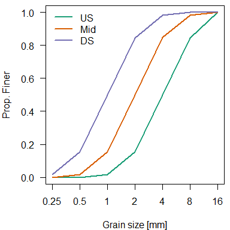
<p class="caption">Grain size distributions used in the example model test case.</p>
</div>

### Discharge and sediment supply
REM is driven by a user-supplied discharge time series (with discharge in m^3^ s^-1^). This can be given at any daily or sub-daily time step (e.g. hourly or 15-minute). Just make sure to specify the discharge time step (dt_Q) in the "Model Inputs.txt" control file. These discharges are provided at each time step for each reach. This discharge data can come from anywhere (e.g. USGS gages, hydrologic models, etc.) but must be formatted into columns for each modeled reach. For our example, we will take USGS gage data from a stream and scale the values based on drainage area to get a unique discharge for each reach in the network. [Note, if using R, the `dataRetrieval` package is immensely useful for obtaining all sorts of USGS data. Just remember to convert discharge from cfs to cms.]

For our example, lets assume that one of the upstream sub-watersheds (reaches 1 and 2) have urbanized. We've increased discharge in these reaches to simulate increased runoff.

<table class="table table-condensed" style="width: auto !important; margin-left: auto; margin-right: auto;">
<tbody>
  <tr>
   <td style="text-align:right;"> 0.0197167 </td>
   <td style="text-align:right;"> 0.0197167 </td>
   <td style="text-align:right;"> 0.0098584 </td>
   <td style="text-align:right;"> 0.0098584 </td>
   <td style="text-align:right;"> 0.0295751 </td>
   <td style="text-align:right;"> 0.0197167 </td>
   <td style="text-align:right;"> 0.0492918 </td>
   <td style="text-align:right;"> 0.0591501 </td>
  </tr>
  <tr>
   <td style="text-align:right;"> 0.0185836 </td>
   <td style="text-align:right;"> 0.0185836 </td>
   <td style="text-align:right;"> 0.0092918 </td>
   <td style="text-align:right;"> 0.0092918 </td>
   <td style="text-align:right;"> 0.0278754 </td>
   <td style="text-align:right;"> 0.0185836 </td>
   <td style="text-align:right;"> 0.0464589 </td>
   <td style="text-align:right;"> 0.0557507 </td>
  </tr>
  <tr>
   <td style="text-align:right;"> 0.0158640 </td>
   <td style="text-align:right;"> 0.0158640 </td>
   <td style="text-align:right;"> 0.0079320 </td>
   <td style="text-align:right;"> 0.0079320 </td>
   <td style="text-align:right;"> 0.0237960 </td>
   <td style="text-align:right;"> 0.0158640 </td>
   <td style="text-align:right;"> 0.0396601 </td>
   <td style="text-align:right;"> 0.0475921 </td>
  </tr>
  <tr>
   <td style="text-align:right;"> 0.0135977 </td>
   <td style="text-align:right;"> 0.0135977 </td>
   <td style="text-align:right;"> 0.0067989 </td>
   <td style="text-align:right;"> 0.0067989 </td>
   <td style="text-align:right;"> 0.0203966 </td>
   <td style="text-align:right;"> 0.0135977 </td>
   <td style="text-align:right;"> 0.0339943 </td>
   <td style="text-align:right;"> 0.0407932 </td>
  </tr>
  <tr>
   <td style="text-align:right;"> 0.0123513 </td>
   <td style="text-align:right;"> 0.0123513 </td>
   <td style="text-align:right;"> 0.0061756 </td>
   <td style="text-align:right;"> 0.0061756 </td>
   <td style="text-align:right;"> 0.0185269 </td>
   <td style="text-align:right;"> 0.0123513 </td>
   <td style="text-align:right;"> 0.0308782 </td>
   <td style="text-align:right;"> 0.0370538 </td>
  </tr>
  <tr>
   <td style="text-align:right;"> 0.0122380 </td>
   <td style="text-align:right;"> 0.0122380 </td>
   <td style="text-align:right;"> 0.0061190 </td>
   <td style="text-align:right;"> 0.0061190 </td>
   <td style="text-align:right;"> 0.0183569 </td>
   <td style="text-align:right;"> 0.0122380 </td>
   <td style="text-align:right;"> 0.0305949 </td>
   <td style="text-align:right;"> 0.0367139 </td>
  </tr>
</tbody>
</table>

Sediment supply must be provided at the same time step as the discharge. This is the sediment supplied at the upstream end of each reach. If no "Input sed supply.txt" file is provided, sediment supply defaults to zero for all reaches. Users can either provide a total sediment transport rate (m^3^ m^-1^ s^-1^) or specify sediment transport rate as a fraction of the transport capacity at the upstream most cross section of the reach in question. To do this, you simply supply negative values from 0 - 1. We will show examples of both approaches below. First, you may be interested in specifying a rate of sediment transport based on the daily discharge series:

<table class="table table-condensed" style="width: auto !important; margin-left: auto; margin-right: auto;">
<tbody>
  <tr>
   <td style="text-align:right;"> 1e-04 </td>
   <td style="text-align:right;"> 1e-04 </td>
   <td style="text-align:right;"> 0 </td>
   <td style="text-align:right;"> 0 </td>
   <td style="text-align:right;"> 0 </td>
   <td style="text-align:right;"> 0 </td>
   <td style="text-align:right;"> 0 </td>
   <td style="text-align:right;"> 0 </td>
  </tr>
  <tr>
   <td style="text-align:right;"> 1e-04 </td>
   <td style="text-align:right;"> 1e-04 </td>
   <td style="text-align:right;"> 0 </td>
   <td style="text-align:right;"> 0 </td>
   <td style="text-align:right;"> 0 </td>
   <td style="text-align:right;"> 0 </td>
   <td style="text-align:right;"> 0 </td>
   <td style="text-align:right;"> 0 </td>
  </tr>
  <tr>
   <td style="text-align:right;"> 1e-04 </td>
   <td style="text-align:right;"> 1e-04 </td>
   <td style="text-align:right;"> 0 </td>
   <td style="text-align:right;"> 0 </td>
   <td style="text-align:right;"> 0 </td>
   <td style="text-align:right;"> 0 </td>
   <td style="text-align:right;"> 0 </td>
   <td style="text-align:right;"> 0 </td>
  </tr>
  <tr>
   <td style="text-align:right;"> 0e+00 </td>
   <td style="text-align:right;"> 0e+00 </td>
   <td style="text-align:right;"> 0 </td>
   <td style="text-align:right;"> 0 </td>
   <td style="text-align:right;"> 0 </td>
   <td style="text-align:right;"> 0 </td>
   <td style="text-align:right;"> 0 </td>
   <td style="text-align:right;"> 0 </td>
  </tr>
  <tr>
   <td style="text-align:right;"> 0e+00 </td>
   <td style="text-align:right;"> 0e+00 </td>
   <td style="text-align:right;"> 0 </td>
   <td style="text-align:right;"> 0 </td>
   <td style="text-align:right;"> 0 </td>
   <td style="text-align:right;"> 0 </td>
   <td style="text-align:right;"> 0 </td>
   <td style="text-align:right;"> 0 </td>
  </tr>
  <tr>
   <td style="text-align:right;"> 0e+00 </td>
   <td style="text-align:right;"> 0e+00 </td>
   <td style="text-align:right;"> 0 </td>
   <td style="text-align:right;"> 0 </td>
   <td style="text-align:right;"> 0 </td>
   <td style="text-align:right;"> 0 </td>
   <td style="text-align:right;"> 0 </td>
   <td style="text-align:right;"> 0 </td>
  </tr>
</tbody>
</table>

In this example, any discharge above 0.0158 m^3^ s^-1^ has some small sediment supply in the headwater channels only. Note that these are total sediment transport rates which are multiplied by the *initial*, user-supplied grain size distribution to get sediment transport by grain size.

It may be more useful to provide sediment supply as a fraction of transport capacity. For our example, we will keep sediment supply in tributaries 3 and 4 equal to transport capacity, but set sediment supply to half of transport capacity in tributaries 1 and 2 (the urbanized area).

<table class="table table-condensed" style="width: auto !important; margin-left: auto; margin-right: auto;">
<tbody>
  <tr>
   <td style="text-align:right;"> -0.5 </td>
   <td style="text-align:right;"> -0.5 </td>
   <td style="text-align:right;"> -1 </td>
   <td style="text-align:right;"> -1 </td>
   <td style="text-align:right;"> 0 </td>
   <td style="text-align:right;"> 0 </td>
   <td style="text-align:right;"> 0 </td>
   <td style="text-align:right;"> 0 </td>
  </tr>
  <tr>
   <td style="text-align:right;"> -0.5 </td>
   <td style="text-align:right;"> -0.5 </td>
   <td style="text-align:right;"> -1 </td>
   <td style="text-align:right;"> -1 </td>
   <td style="text-align:right;"> 0 </td>
   <td style="text-align:right;"> 0 </td>
   <td style="text-align:right;"> 0 </td>
   <td style="text-align:right;"> 0 </td>
  </tr>
  <tr>
   <td style="text-align:right;"> -0.5 </td>
   <td style="text-align:right;"> -0.5 </td>
   <td style="text-align:right;"> -1 </td>
   <td style="text-align:right;"> -1 </td>
   <td style="text-align:right;"> 0 </td>
   <td style="text-align:right;"> 0 </td>
   <td style="text-align:right;"> 0 </td>
   <td style="text-align:right;"> 0 </td>
  </tr>
  <tr>
   <td style="text-align:right;"> -0.5 </td>
   <td style="text-align:right;"> -0.5 </td>
   <td style="text-align:right;"> -1 </td>
   <td style="text-align:right;"> -1 </td>
   <td style="text-align:right;"> 0 </td>
   <td style="text-align:right;"> 0 </td>
   <td style="text-align:right;"> 0 </td>
   <td style="text-align:right;"> 0 </td>
  </tr>
  <tr>
   <td style="text-align:right;"> -0.5 </td>
   <td style="text-align:right;"> -0.5 </td>
   <td style="text-align:right;"> -1 </td>
   <td style="text-align:right;"> -1 </td>
   <td style="text-align:right;"> 0 </td>
   <td style="text-align:right;"> 0 </td>
   <td style="text-align:right;"> 0 </td>
   <td style="text-align:right;"> 0 </td>
  </tr>
  <tr>
   <td style="text-align:right;"> -0.5 </td>
   <td style="text-align:right;"> -0.5 </td>
   <td style="text-align:right;"> -1 </td>
   <td style="text-align:right;"> -1 </td>
   <td style="text-align:right;"> 0 </td>
   <td style="text-align:right;"> 0 </td>
   <td style="text-align:right;"> 0 </td>
   <td style="text-align:right;"> 0 </td>
  </tr>
</tbody>
</table>

In this example, we set the sediment supply for reaches 1 and 2 equal to 50% of the transport capacity of the most upstream cross section in these reaches. This approach will compute the sediment transport capacity *for each grain size* at this cross section. Therefore, the sediment supply will evolve over time as bed grain size changes and as the channel geometry and slope evolve.

### Bank soil properties
Bank soil properties are specified in the "Input bank prop.txt" file. These inputs are provided by reach. For our example, we will have consistent values for all reaches:

<table class="table table-condensed" style="width: auto !important; margin-left: auto; margin-right: auto;">
<tbody>
  <tr>
   <td style="text-align:right;"> 5 </td>
   <td style="text-align:right;"> 0 </td>
   <td style="text-align:right;"> 3 </td>
   <td style="text-align:right;"> 3 </td>
   <td style="text-align:right;"> 30 </td>
   <td style="text-align:right;"> 30 </td>
   <td style="text-align:right;"> 18 </td>
   <td style="text-align:right;"> 18 </td>
   <td style="text-align:right;"> 350 </td>
   <td style="text-align:right;"> 0 </td>
   <td style="text-align:right;"> 0.5 </td>
   <td style="text-align:right;"> 0.5 </td>
  </tr>
  <tr>
   <td style="text-align:right;"> 5 </td>
   <td style="text-align:right;"> 0 </td>
   <td style="text-align:right;"> 3 </td>
   <td style="text-align:right;"> 3 </td>
   <td style="text-align:right;"> 30 </td>
   <td style="text-align:right;"> 30 </td>
   <td style="text-align:right;"> 18 </td>
   <td style="text-align:right;"> 18 </td>
   <td style="text-align:right;"> 350 </td>
   <td style="text-align:right;"> 0 </td>
   <td style="text-align:right;"> 0.5 </td>
   <td style="text-align:right;"> 0.5 </td>
  </tr>
  <tr>
   <td style="text-align:right;"> 5 </td>
   <td style="text-align:right;"> 0 </td>
   <td style="text-align:right;"> 3 </td>
   <td style="text-align:right;"> 3 </td>
   <td style="text-align:right;"> 30 </td>
   <td style="text-align:right;"> 30 </td>
   <td style="text-align:right;"> 18 </td>
   <td style="text-align:right;"> 18 </td>
   <td style="text-align:right;"> 350 </td>
   <td style="text-align:right;"> 0 </td>
   <td style="text-align:right;"> 0.5 </td>
   <td style="text-align:right;"> 0.5 </td>
  </tr>
  <tr>
   <td style="text-align:right;"> 5 </td>
   <td style="text-align:right;"> 0 </td>
   <td style="text-align:right;"> 3 </td>
   <td style="text-align:right;"> 3 </td>
   <td style="text-align:right;"> 30 </td>
   <td style="text-align:right;"> 30 </td>
   <td style="text-align:right;"> 18 </td>
   <td style="text-align:right;"> 18 </td>
   <td style="text-align:right;"> 350 </td>
   <td style="text-align:right;"> 0 </td>
   <td style="text-align:right;"> 0.5 </td>
   <td style="text-align:right;"> 0.5 </td>
  </tr>
  <tr>
   <td style="text-align:right;"> 5 </td>
   <td style="text-align:right;"> 0 </td>
   <td style="text-align:right;"> 3 </td>
   <td style="text-align:right;"> 3 </td>
   <td style="text-align:right;"> 30 </td>
   <td style="text-align:right;"> 30 </td>
   <td style="text-align:right;"> 18 </td>
   <td style="text-align:right;"> 18 </td>
   <td style="text-align:right;"> 350 </td>
   <td style="text-align:right;"> 0 </td>
   <td style="text-align:right;"> 0.5 </td>
   <td style="text-align:right;"> 0.5 </td>
  </tr>
  <tr>
   <td style="text-align:right;"> 5 </td>
   <td style="text-align:right;"> 0 </td>
   <td style="text-align:right;"> 3 </td>
   <td style="text-align:right;"> 3 </td>
   <td style="text-align:right;"> 30 </td>
   <td style="text-align:right;"> 30 </td>
   <td style="text-align:right;"> 18 </td>
   <td style="text-align:right;"> 18 </td>
   <td style="text-align:right;"> 350 </td>
   <td style="text-align:right;"> 0 </td>
   <td style="text-align:right;"> 0.5 </td>
   <td style="text-align:right;"> 0.5 </td>
  </tr>
  <tr>
   <td style="text-align:right;"> 5 </td>
   <td style="text-align:right;"> 0 </td>
   <td style="text-align:right;"> 3 </td>
   <td style="text-align:right;"> 3 </td>
   <td style="text-align:right;"> 30 </td>
   <td style="text-align:right;"> 30 </td>
   <td style="text-align:right;"> 18 </td>
   <td style="text-align:right;"> 18 </td>
   <td style="text-align:right;"> 350 </td>
   <td style="text-align:right;"> 0 </td>
   <td style="text-align:right;"> 0.5 </td>
   <td style="text-align:right;"> 0.5 </td>
  </tr>
  <tr>
   <td style="text-align:right;"> 5 </td>
   <td style="text-align:right;"> 0 </td>
   <td style="text-align:right;"> 3 </td>
   <td style="text-align:right;"> 3 </td>
   <td style="text-align:right;"> 30 </td>
   <td style="text-align:right;"> 30 </td>
   <td style="text-align:right;"> 18 </td>
   <td style="text-align:right;"> 18 </td>
   <td style="text-align:right;"> 350 </td>
   <td style="text-align:right;"> 0 </td>
   <td style="text-align:right;"> 0.5 </td>
   <td style="text-align:right;"> 0.5 </td>
  </tr>
</tbody>
</table>

The first column is the critical shear stress ($\tau_c$; Pa) of the bank toe soil. The second column is soil erodiblity ($k$; m^3^ N^-1^ s^-1^). If this value is set to 0 (as it is here) REM calculates soil erodiblity based on $\tau_c$ [@Simon2010]:

$$k = 1.6 \times 10^{-6} \tau_c^{-0.826} $$
The next six columns are used in the bank stability modeling. First, are two columns of soil cohesion for the bank and bank toe, respectively (kPa). Next are the friction angle for bank and bank toe (degrees). Finally, there is the saturated unit weight of the bank and bank toe (kN m^-3^). For our examples, these values are the same for the bank and toe soil layers. The next two columns are the pollutant concentration of the bank (e.g. 350) and cohesive bed and knickpoint soil (e.g. 0; both in mg pollutant/kg soil). The final two columns are the fraction of the bank and cohesive bed/knickpoint soil that are bed material load (e.g. sand and coarser). The remainder of this eroded soil is washload (silt and clay).

### Meandering
REM simulates meander migration and subsequent channel elongation. This provides an additional mode by which evolving channels can reduce their slope (longer channels = higher sinuosity = lower slope). To do this, REM calculates the higher bank shear stresses observed on the outside of meander bends as a function of bend tightness (bend radius of curvature divided by channel width) [@ArmyCorpsofEngineers1970a]:

$$\tau_{max} = 2.65 \tau_w \left( \frac{R_c}{w} \right)$$
where $\tau_{max}$ is the maximum bank shear stress on the outside of the bend (Pa), $\tau_w$ is the wall/bank shear stress in the straight channel (Pa), $R_c$ is the radius of curvature (m), and $w$ is channel width (m).

REM assumes the meandering channel is made up of circular arc segments. It does not simulate complex bend geometry, down-valley meander translation, or meander cutoff. To initially build the sinuous channel, and subsequently track changes in channel sinuosity, the user must supply an initial sinuosity and average $R_c$ value for each reach. For our example, we will assume the channel gets more sinuous moving downstream. We will also increase the $R_c$ value but keep the ratio of $R_c$ to channel width consistent among reaches.

<table class="table table-condensed" style="width: auto !important; margin-left: auto; margin-right: auto;">
<tbody>
  <tr>
   <td style="text-align:right;"> 1.3 </td>
   <td style="text-align:right;"> 20 </td>
  </tr>
  <tr>
   <td style="text-align:right;"> 1.3 </td>
   <td style="text-align:right;"> 20 </td>
  </tr>
  <tr>
   <td style="text-align:right;"> 1.3 </td>
   <td style="text-align:right;"> 20 </td>
  </tr>
  <tr>
   <td style="text-align:right;"> 1.3 </td>
   <td style="text-align:right;"> 20 </td>
  </tr>
  <tr>
   <td style="text-align:right;"> 1.5 </td>
   <td style="text-align:right;"> 32 </td>
  </tr>
  <tr>
   <td style="text-align:right;"> 1.5 </td>
   <td style="text-align:right;"> 32 </td>
  </tr>
  <tr>
   <td style="text-align:right;"> 1.7 </td>
   <td style="text-align:right;"> 48 </td>
  </tr>
  <tr>
   <td style="text-align:right;"> 1.7 </td>
   <td style="text-align:right;"> 48 </td>
  </tr>
</tbody>
</table>

This "Input meandering.txt" file has two columns: the first specifies initial sinuosity for each reach and the second is initial $R_c$ for each reach. To include meandering in the model, the user must set the `meandering` value to 1 in the "Model Inputs.txt" control file.

### Knickpoint migration
The final module that REM incorporates is a knickpoint migration algorithm [@Allen2018a]. This algorithm calculates the rate of knickpoint reatreat as a function of cumulative daily discharge, knickpoint height, and knickpoint soil erodibility. Knickpoint migration is highly sensitive to the selected value of soil erodiblity and we suggest that this value be calibrated to give realistic migration rates (see @Lammers2018b or @Lammers2018c for more information). To model knickpoint migration, the user must input the reach the knickpoint is located in, its distance downstream from the top of that reach, its elevation, its height, and its erodibility (see figure below).

<div class="figure" style="text-align: center">

<p class="caption">Schematic showing example of knickpoint in model. The user must specify the knickpoints location from the upstream end of the reach, its elevation, and its height. Note that the slope of the sub-reach is the same above and below the knickpoint.</p>
</div>

For our example, if we wanted to include a 0.5 m hight knickpoint in Reach 5:

<table class="table table-condensed" style="width: auto !important; margin-left: auto; margin-right: auto;">
<tbody>
  <tr>
   <td style="text-align:right;"> 5 </td>
   <td style="text-align:right;"> 190 </td>
   <td style="text-align:right;"> 18.5 </td>
   <td style="text-align:right;"> 0.5 </td>
   <td style="text-align:right;"> 0.235 </td>
  </tr>
</tbody>
</table>

This "Input knickpoint.txt" file has one row per knickpoint. The first column is the reach in which the knickpoint is located, the second is the distance downstream from the top of that reach (m), the third is the elevation of the top of the knickpoint (m), the fourth is the height of the knickpoint (m), and the final value is the knickpoint erodibility (cm Pa^-1^). As long as the "Input knickpoint.txt" file is included in the model folder, REM will simulate knickpoint migration. To turn off this module, simply delete the "Input knickpoint.txt" file.

### Model assumptions/fixed values
There are a few values that are hard-coded into REM:

* Bed porosity = 0.4
* Sediment specific gravity = 2.65
* Water specific weight = 9,810 N m^-3^
* Soil bulk density (for eroded washload) = 1,600 kg m^-3^

## Running REM
Once the model input files are created, running REM is very simple. Simply copy the .exe file into the same folder as all the inputs and double click it. A dialoge box will open once the model is running with some information on the model run and a progress bar.

<div class="figure" style="text-align: center">

<p class="caption">Dialogue box shown during model run.</p>
</div>

The "Input file path:" should be blank. Other general model inputs are shown (XS spacing, time step, sediment transport equation, etc.). This will also show whether the "normal version" of the model is being run or if it is running in Monte Carlo mode. Finally, a progress bar is shown.

Once the model has completed, the dialogue box will close. All inputs will be printed as text files in the same directory as the model input files. The "Model Output Summary.txt" file provides a summary of the model run. It shows general model settings/inputs, the time it took the model to run, and any warning messages (typically using the sediment transport equations outside the values for which they were developed).

<div class="figure" style="text-align: center">

<p class="caption">Output summary file created for each model run.</p>
</div>

If the model crashes, a "MODEL ERRORS.txt" file will be printed which provides some (hopefully) useful details on what went wrong. The most common issues are too large of a time step for sediment transport/bed evolution modeling and errors in the model input files. There are currently checks for whether the required input files exist, but I will be adding better checks of model input file format in the future to catch errors and prevent model crashes.

Since the time step is so important for model stability, I recommend first running the model with only sediment transport/bed evolution included (e.g. no bank erosion, meandering, or knickpoint). This will allow you to find the best value of `dt` that allows the model to run without crashing but also allows the model to finish in a reasonable amount of time (note, `dt` should be a whole fraction of the discharge time step; e.g. 2400 s for a 86400 dt_Q). After this is complete, you can turn on the other processes you wish to include. The biggest factors that control the model run time are the time step, cross section spacing, and number of grain sizes in your bed sediment grain distribution.

Note that the model output files are printed to the same folder as the where the model is run. Any old model outputs are overwritten each time the model is run. To save output from multiple simulations, run each in a separate folder.
  
## Model Outputs and Post-processing
REM outputs data on how the channel evolves over time. This includes cross section geometry, longitudinal profile, bed grain size, and sinuosity. In addition, REM outputs fine sediment and pollutant loading from eroded banks, cohesive bed, and knickpoints. A summary of all model outputs is provided in the table below.

<table class="table table-condensed" style="margin-left: auto; margin-right: auto;">
<caption>List of model output files</caption>
 <thead>
  <tr>
   <th style="text-align:left;"> File.Name </th>
   <th style="text-align:left;"> Description </th>
  </tr>
 </thead>
<tbody>
  <tr>
   <td style="text-align:left;"> Model Output Summary.txt </td>
   <td style="text-align:left;width: 40em; "> Summary of model settings used, model run time, and any warning messages </td>
  </tr>
  <tr>
   <td style="text-align:left;"> Output bank loading.txt </td>
   <td style="text-align:left;width: 40em; "> Fine sediment ("Sed") and pollutant ("P") loading (kg) for each reach at each discharge time step. Includes loading from bank erosion and cohesive bed and knickpoint erosion (if applicable). </td>
  </tr>
  <tr>
   <td style="text-align:left;"> Output bed mass.txt </td>
   <td style="text-align:left;width: 40em; "> Cumulative mass of bed material load exported from the watershed (kg) output at discharge time step </td>
  </tr>
  <tr>
   <td style="text-align:left;"> Output D50.txt </td>
   <td style="text-align:left;width: 40em; "> Bed sediment $D_{50}$ for each cross section. </td>
  </tr>
  <tr>
   <td style="text-align:left;"> Output dx.txt </td>
   <td style="text-align:left;width: 40em; "> XS spacing for each cross section. Only changes if "meandering" = 1. </td>
  </tr>
  <tr>
   <td style="text-align:left;"> Output knick locations.txt </td>
   <td style="text-align:left;width: 40em; "> Locations of any knickpoints (distance downstream from each XS, in meters). </td>
  </tr>
  <tr>
   <td style="text-align:left;"> Output Rc.txt </td>
   <td style="text-align:left;width: 40em; "> Meander bend radius of curvature for each cross section. </td>
  </tr>
  <tr>
   <td style="text-align:left;"> Output sediment vol.txt </td>
   <td style="text-align:left;width: 40em; "> Cumulative volume (m$^3$) of sediment exported from the watershed from various sources for each discharge time step. See text for more details on each. </td>
  </tr>
  <tr>
   <td style="text-align:left;"> Output sinuosity.txt </td>
   <td style="text-align:left;width: 40em; "> Sinuosity of each reach. </td>
  </tr>
  <tr>
   <td style="text-align:left;"> Output slope.txt </td>
   <td style="text-align:left;width: 40em; "> Bed slope for each cross section. </td>
  </tr>
  <tr>
   <td style="text-align:left;"> Output stream power.txt </td>
   <td style="text-align:left;width: 40em; "> Specific stream power (W m$^{-2}$) for each cross section. </td>
  </tr>
  <tr>
   <td style="text-align:left;"> Output width.txt </td>
   <td style="text-align:left;width: 40em; "> Average of channel bottom and top width (m) for each cross section. </td>
  </tr>
  <tr>
   <td style="text-align:left;"> Output XS geometry all.txt </td>
   <td style="text-align:left;width: 40em; "> Cross section geometry for all XS. Columns 2-11 are station (x) values and columns 12-21 are elevation (y) values (both in meters). For each time step, all XS are listed in order by reach moving downstream. </td>
  </tr>
  <tr>
   <td style="text-align:left;"> Output XS geometry.txt </td>
   <td style="text-align:left;width: 40em; "> Cross section geometry for most upstream XS of each reach. Same format as "Output XS geometry all.txt" </td>
  </tr>
  <tr>
   <td style="text-align:left;"> Output z.txt </td>
   <td style="text-align:left;width: 40em; "> Bed elevation (m) for each cross section. </td>
  </tr>
</tbody>
</table>

Most outputs are printed at the user-specified time step ("dt_output"). In these cases, the first column of the output is the discharge time step. Outputs for each reach are printed on a separate line (for all cross sections within the reach). For example, we can look at the first several outputs for modeled average channel width (average of bottom and top width).

<table class="table table-condensed" style="width: auto !important; margin-left: auto; margin-right: auto;">
 <thead>
  <tr>
   <th style="text-align:right;"> V1 </th>
   <th style="text-align:right;"> V2 </th>
   <th style="text-align:right;"> V3 </th>
   <th style="text-align:right;"> V4 </th>
   <th style="text-align:right;"> V5 </th>
   <th style="text-align:right;"> V6 </th>
   <th style="text-align:right;"> V7 </th>
   <th style="text-align:right;"> V8 </th>
   <th style="text-align:right;"> V9 </th>
   <th style="text-align:right;"> V10 </th>
   <th style="text-align:right;"> V11 </th>
   <th style="text-align:right;"> V12 </th>
   <th style="text-align:right;"> V13 </th>
   <th style="text-align:right;"> V14 </th>
   <th style="text-align:right;"> V15 </th>
   <th style="text-align:right;"> V16 </th>
  </tr>
 </thead>
<tbody>
  <tr>
   <td style="text-align:right;"> 0 </td>
   <td style="text-align:right;"> 6.57735 </td>
   <td style="text-align:right;"> 6.57735 </td>
   <td style="text-align:right;"> 6.57735 </td>
   <td style="text-align:right;"> 6.57735 </td>
   <td style="text-align:right;"> 6.57735 </td>
   <td style="text-align:right;"> 6.57735 </td>
   <td style="text-align:right;"> 6.57735 </td>
   <td style="text-align:right;"> 6.57735 </td>
   <td style="text-align:right;"> 6.57735 </td>
   <td style="text-align:right;"> 6.57735 </td>
   <td style="text-align:right;"> 6.57735 </td>
   <td style="text-align:right;"> 6.57735 </td>
   <td style="text-align:right;"> 6.57735 </td>
   <td style="text-align:right;"> 6.57735 </td>
   <td style="text-align:right;"> 6.57735 </td>
  </tr>
  <tr>
   <td style="text-align:right;"> 0 </td>
   <td style="text-align:right;"> 6.57735 </td>
   <td style="text-align:right;"> 6.57735 </td>
   <td style="text-align:right;"> 6.57735 </td>
   <td style="text-align:right;"> 6.57735 </td>
   <td style="text-align:right;"> 6.57735 </td>
   <td style="text-align:right;"> 6.57735 </td>
   <td style="text-align:right;"> 6.57735 </td>
   <td style="text-align:right;"> 6.57735 </td>
   <td style="text-align:right;"> 6.57735 </td>
   <td style="text-align:right;"> 6.57735 </td>
   <td style="text-align:right;"> 6.57735 </td>
   <td style="text-align:right;"> 6.57735 </td>
   <td style="text-align:right;"> 6.57735 </td>
   <td style="text-align:right;"> 6.57735 </td>
   <td style="text-align:right;"> 6.57735 </td>
  </tr>
  <tr>
   <td style="text-align:right;"> 0 </td>
   <td style="text-align:right;"> 6.57735 </td>
   <td style="text-align:right;"> 6.57735 </td>
   <td style="text-align:right;"> 6.57735 </td>
   <td style="text-align:right;"> 6.57735 </td>
   <td style="text-align:right;"> 6.57735 </td>
   <td style="text-align:right;"> 6.57735 </td>
   <td style="text-align:right;"> 6.57735 </td>
   <td style="text-align:right;"> 6.57735 </td>
   <td style="text-align:right;"> 6.57735 </td>
   <td style="text-align:right;"> 6.57735 </td>
   <td style="text-align:right;"> 6.57735 </td>
   <td style="text-align:right;"> 6.57735 </td>
   <td style="text-align:right;"> 6.57735 </td>
   <td style="text-align:right;"> 6.57735 </td>
   <td style="text-align:right;"> 6.57735 </td>
  </tr>
  <tr>
   <td style="text-align:right;"> 0 </td>
   <td style="text-align:right;"> 6.57735 </td>
   <td style="text-align:right;"> 6.57735 </td>
   <td style="text-align:right;"> 6.57735 </td>
   <td style="text-align:right;"> 6.57735 </td>
   <td style="text-align:right;"> 6.57735 </td>
   <td style="text-align:right;"> 6.57735 </td>
   <td style="text-align:right;"> 6.57735 </td>
   <td style="text-align:right;"> 6.57735 </td>
   <td style="text-align:right;"> 6.57735 </td>
   <td style="text-align:right;"> 6.57735 </td>
   <td style="text-align:right;"> 6.57735 </td>
   <td style="text-align:right;"> 6.57735 </td>
   <td style="text-align:right;"> 6.57735 </td>
   <td style="text-align:right;"> 6.57735 </td>
   <td style="text-align:right;"> 6.57735 </td>
  </tr>
  <tr>
   <td style="text-align:right;"> 0 </td>
   <td style="text-align:right;"> 9.57735 </td>
   <td style="text-align:right;"> 9.57735 </td>
   <td style="text-align:right;"> 9.57735 </td>
   <td style="text-align:right;"> 9.57735 </td>
   <td style="text-align:right;"> 9.57735 </td>
   <td style="text-align:right;"> 9.57735 </td>
   <td style="text-align:right;"> 9.57735 </td>
   <td style="text-align:right;"> 9.57735 </td>
   <td style="text-align:right;"> 9.57735 </td>
   <td style="text-align:right;"> 9.57735 </td>
   <td style="text-align:right;"> 0.00000 </td>
   <td style="text-align:right;"> 0.00000 </td>
   <td style="text-align:right;"> 0.00000 </td>
   <td style="text-align:right;"> 0.00000 </td>
   <td style="text-align:right;"> 0.00000 </td>
  </tr>
  <tr>
   <td style="text-align:right;"> 0 </td>
   <td style="text-align:right;"> 9.57735 </td>
   <td style="text-align:right;"> 9.57735 </td>
   <td style="text-align:right;"> 9.57735 </td>
   <td style="text-align:right;"> 9.57735 </td>
   <td style="text-align:right;"> 9.57735 </td>
   <td style="text-align:right;"> 9.57735 </td>
   <td style="text-align:right;"> 9.57735 </td>
   <td style="text-align:right;"> 9.57735 </td>
   <td style="text-align:right;"> 9.57735 </td>
   <td style="text-align:right;"> 9.57735 </td>
   <td style="text-align:right;"> 0.00000 </td>
   <td style="text-align:right;"> 0.00000 </td>
   <td style="text-align:right;"> 0.00000 </td>
   <td style="text-align:right;"> 0.00000 </td>
   <td style="text-align:right;"> 0.00000 </td>
  </tr>
  <tr>
   <td style="text-align:right;"> 0 </td>
   <td style="text-align:right;"> 13.57740 </td>
   <td style="text-align:right;"> 13.57740 </td>
   <td style="text-align:right;"> 13.57740 </td>
   <td style="text-align:right;"> 13.57740 </td>
   <td style="text-align:right;"> 13.57740 </td>
   <td style="text-align:right;"> 13.57740 </td>
   <td style="text-align:right;"> 13.57740 </td>
   <td style="text-align:right;"> 13.57740 </td>
   <td style="text-align:right;"> 13.57740 </td>
   <td style="text-align:right;"> 13.57740 </td>
   <td style="text-align:right;"> 0.00000 </td>
   <td style="text-align:right;"> 0.00000 </td>
   <td style="text-align:right;"> 0.00000 </td>
   <td style="text-align:right;"> 0.00000 </td>
   <td style="text-align:right;"> 0.00000 </td>
  </tr>
  <tr>
   <td style="text-align:right;"> 0 </td>
   <td style="text-align:right;"> 13.57740 </td>
   <td style="text-align:right;"> 13.57740 </td>
   <td style="text-align:right;"> 13.57740 </td>
   <td style="text-align:right;"> 13.57740 </td>
   <td style="text-align:right;"> 13.57740 </td>
   <td style="text-align:right;"> 0.00000 </td>
   <td style="text-align:right;"> 0.00000 </td>
   <td style="text-align:right;"> 0.00000 </td>
   <td style="text-align:right;"> 0.00000 </td>
   <td style="text-align:right;"> 0.00000 </td>
   <td style="text-align:right;"> 0.00000 </td>
   <td style="text-align:right;"> 0.00000 </td>
   <td style="text-align:right;"> 0.00000 </td>
   <td style="text-align:right;"> 0.00000 </td>
   <td style="text-align:right;"> 0.00000 </td>
  </tr>
  <tr>
   <td style="text-align:right;"> 73 </td>
   <td style="text-align:right;"> 6.57735 </td>
   <td style="text-align:right;"> 6.57735 </td>
   <td style="text-align:right;"> 6.57735 </td>
   <td style="text-align:right;"> 6.57735 </td>
   <td style="text-align:right;"> 6.57735 </td>
   <td style="text-align:right;"> 6.57735 </td>
   <td style="text-align:right;"> 6.57735 </td>
   <td style="text-align:right;"> 6.57735 </td>
   <td style="text-align:right;"> 6.57735 </td>
   <td style="text-align:right;"> 6.57735 </td>
   <td style="text-align:right;"> 6.57735 </td>
   <td style="text-align:right;"> 6.57735 </td>
   <td style="text-align:right;"> 6.57735 </td>
   <td style="text-align:right;"> 6.57735 </td>
   <td style="text-align:right;"> 6.57735 </td>
  </tr>
  <tr>
   <td style="text-align:right;"> 73 </td>
   <td style="text-align:right;"> 6.57735 </td>
   <td style="text-align:right;"> 6.57735 </td>
   <td style="text-align:right;"> 6.57735 </td>
   <td style="text-align:right;"> 6.57735 </td>
   <td style="text-align:right;"> 6.57735 </td>
   <td style="text-align:right;"> 6.57735 </td>
   <td style="text-align:right;"> 6.57735 </td>
   <td style="text-align:right;"> 6.57735 </td>
   <td style="text-align:right;"> 6.57735 </td>
   <td style="text-align:right;"> 6.57735 </td>
   <td style="text-align:right;"> 6.57735 </td>
   <td style="text-align:right;"> 6.57735 </td>
   <td style="text-align:right;"> 6.57735 </td>
   <td style="text-align:right;"> 6.57735 </td>
   <td style="text-align:right;"> 6.57735 </td>
  </tr>
  <tr>
   <td style="text-align:right;"> 73 </td>
   <td style="text-align:right;"> 6.57735 </td>
   <td style="text-align:right;"> 6.57735 </td>
   <td style="text-align:right;"> 6.57735 </td>
   <td style="text-align:right;"> 6.57735 </td>
   <td style="text-align:right;"> 6.57735 </td>
   <td style="text-align:right;"> 6.57735 </td>
   <td style="text-align:right;"> 6.57735 </td>
   <td style="text-align:right;"> 6.57735 </td>
   <td style="text-align:right;"> 6.57735 </td>
   <td style="text-align:right;"> 6.57735 </td>
   <td style="text-align:right;"> 6.57735 </td>
   <td style="text-align:right;"> 6.57735 </td>
   <td style="text-align:right;"> 6.57735 </td>
   <td style="text-align:right;"> 6.57735 </td>
   <td style="text-align:right;"> 6.57735 </td>
  </tr>
  <tr>
   <td style="text-align:right;"> 73 </td>
   <td style="text-align:right;"> 6.57735 </td>
   <td style="text-align:right;"> 6.57735 </td>
   <td style="text-align:right;"> 6.57735 </td>
   <td style="text-align:right;"> 6.57735 </td>
   <td style="text-align:right;"> 6.57735 </td>
   <td style="text-align:right;"> 6.57735 </td>
   <td style="text-align:right;"> 6.57735 </td>
   <td style="text-align:right;"> 6.57735 </td>
   <td style="text-align:right;"> 6.57735 </td>
   <td style="text-align:right;"> 6.57735 </td>
   <td style="text-align:right;"> 6.57735 </td>
   <td style="text-align:right;"> 6.57735 </td>
   <td style="text-align:right;"> 6.57735 </td>
   <td style="text-align:right;"> 6.57735 </td>
   <td style="text-align:right;"> 6.57735 </td>
  </tr>
  <tr>
   <td style="text-align:right;"> 73 </td>
   <td style="text-align:right;"> 9.57735 </td>
   <td style="text-align:right;"> 9.57735 </td>
   <td style="text-align:right;"> 9.57735 </td>
   <td style="text-align:right;"> 9.57735 </td>
   <td style="text-align:right;"> 9.57735 </td>
   <td style="text-align:right;"> 9.57735 </td>
   <td style="text-align:right;"> 9.57735 </td>
   <td style="text-align:right;"> 9.57735 </td>
   <td style="text-align:right;"> 9.57735 </td>
   <td style="text-align:right;"> 9.57735 </td>
   <td style="text-align:right;"> 0.00000 </td>
   <td style="text-align:right;"> 0.00000 </td>
   <td style="text-align:right;"> 0.00000 </td>
   <td style="text-align:right;"> 0.00000 </td>
   <td style="text-align:right;"> 0.00000 </td>
  </tr>
  <tr>
   <td style="text-align:right;"> 73 </td>
   <td style="text-align:right;"> 9.57735 </td>
   <td style="text-align:right;"> 9.57735 </td>
   <td style="text-align:right;"> 9.57735 </td>
   <td style="text-align:right;"> 9.57735 </td>
   <td style="text-align:right;"> 9.57735 </td>
   <td style="text-align:right;"> 9.57735 </td>
   <td style="text-align:right;"> 9.57735 </td>
   <td style="text-align:right;"> 9.57735 </td>
   <td style="text-align:right;"> 9.57735 </td>
   <td style="text-align:right;"> 9.57735 </td>
   <td style="text-align:right;"> 0.00000 </td>
   <td style="text-align:right;"> 0.00000 </td>
   <td style="text-align:right;"> 0.00000 </td>
   <td style="text-align:right;"> 0.00000 </td>
   <td style="text-align:right;"> 0.00000 </td>
  </tr>
  <tr>
   <td style="text-align:right;"> 73 </td>
   <td style="text-align:right;"> 13.57740 </td>
   <td style="text-align:right;"> 13.57740 </td>
   <td style="text-align:right;"> 13.57740 </td>
   <td style="text-align:right;"> 13.57740 </td>
   <td style="text-align:right;"> 13.57740 </td>
   <td style="text-align:right;"> 13.57740 </td>
   <td style="text-align:right;"> 13.57740 </td>
   <td style="text-align:right;"> 13.57740 </td>
   <td style="text-align:right;"> 13.57740 </td>
   <td style="text-align:right;"> 13.57740 </td>
   <td style="text-align:right;"> 0.00000 </td>
   <td style="text-align:right;"> 0.00000 </td>
   <td style="text-align:right;"> 0.00000 </td>
   <td style="text-align:right;"> 0.00000 </td>
   <td style="text-align:right;"> 0.00000 </td>
  </tr>
  <tr>
   <td style="text-align:right;"> 73 </td>
   <td style="text-align:right;"> 13.57740 </td>
   <td style="text-align:right;"> 13.57740 </td>
   <td style="text-align:right;"> 13.57740 </td>
   <td style="text-align:right;"> 13.57740 </td>
   <td style="text-align:right;"> 13.57740 </td>
   <td style="text-align:right;"> 0.00000 </td>
   <td style="text-align:right;"> 0.00000 </td>
   <td style="text-align:right;"> 0.00000 </td>
   <td style="text-align:right;"> 0.00000 </td>
   <td style="text-align:right;"> 0.00000 </td>
   <td style="text-align:right;"> 0.00000 </td>
   <td style="text-align:right;"> 0.00000 </td>
   <td style="text-align:right;"> 0.00000 </td>
   <td style="text-align:right;"> 0.00000 </td>
   <td style="text-align:right;"> 0.00000 </td>
  </tr>
</tbody>
</table>

This shows widths for two simulation days (0 and 73). The zero values indicate no XS data. For example, reach 8 only has five XS so the remaining values are all zero.

Other outputs are printed once per discharge time step. For example, the "Output sed loading.txt" file:

<table class="table table-condensed" style="width: auto !important; margin-left: auto; margin-right: auto;">
 <thead>
  <tr>
   <th style="text-align:right;"> Sed1 </th>
   <th style="text-align:right;"> Sed2 </th>
   <th style="text-align:right;"> Sed3 </th>
   <th style="text-align:right;"> Sed4 </th>
   <th style="text-align:right;"> Sed5 </th>
   <th style="text-align:right;"> Sed6 </th>
   <th style="text-align:right;"> Sed7 </th>
   <th style="text-align:right;"> Sed8 </th>
   <th style="text-align:right;"> P1 </th>
   <th style="text-align:right;"> P2 </th>
   <th style="text-align:right;"> P3 </th>
   <th style="text-align:right;"> P4 </th>
   <th style="text-align:right;"> P5 </th>
   <th style="text-align:right;"> P6 </th>
   <th style="text-align:right;"> P7 </th>
   <th style="text-align:right;"> P8 </th>
  </tr>
 </thead>
<tbody>
  <tr>
   <td style="text-align:right;"> 0 </td>
   <td style="text-align:right;"> 0 </td>
   <td style="text-align:right;"> 0 </td>
   <td style="text-align:right;"> 0 </td>
   <td style="text-align:right;"> 0 </td>
   <td style="text-align:right;"> 0 </td>
   <td style="text-align:right;"> 0 </td>
   <td style="text-align:right;"> 0 </td>
   <td style="text-align:right;"> 0 </td>
   <td style="text-align:right;"> 0 </td>
   <td style="text-align:right;"> 0 </td>
   <td style="text-align:right;"> 0 </td>
   <td style="text-align:right;"> 0 </td>
   <td style="text-align:right;"> 0 </td>
   <td style="text-align:right;"> 0 </td>
   <td style="text-align:right;"> 0 </td>
  </tr>
  <tr>
   <td style="text-align:right;"> 0 </td>
   <td style="text-align:right;"> 0 </td>
   <td style="text-align:right;"> 0 </td>
   <td style="text-align:right;"> 0 </td>
   <td style="text-align:right;"> 0 </td>
   <td style="text-align:right;"> 0 </td>
   <td style="text-align:right;"> 0 </td>
   <td style="text-align:right;"> 0 </td>
   <td style="text-align:right;"> 0 </td>
   <td style="text-align:right;"> 0 </td>
   <td style="text-align:right;"> 0 </td>
   <td style="text-align:right;"> 0 </td>
   <td style="text-align:right;"> 0 </td>
   <td style="text-align:right;"> 0 </td>
   <td style="text-align:right;"> 0 </td>
   <td style="text-align:right;"> 0 </td>
  </tr>
  <tr>
   <td style="text-align:right;"> 0 </td>
   <td style="text-align:right;"> 0 </td>
   <td style="text-align:right;"> 0 </td>
   <td style="text-align:right;"> 0 </td>
   <td style="text-align:right;"> 0 </td>
   <td style="text-align:right;"> 0 </td>
   <td style="text-align:right;"> 0 </td>
   <td style="text-align:right;"> 0 </td>
   <td style="text-align:right;"> 0 </td>
   <td style="text-align:right;"> 0 </td>
   <td style="text-align:right;"> 0 </td>
   <td style="text-align:right;"> 0 </td>
   <td style="text-align:right;"> 0 </td>
   <td style="text-align:right;"> 0 </td>
   <td style="text-align:right;"> 0 </td>
   <td style="text-align:right;"> 0 </td>
  </tr>
  <tr>
   <td style="text-align:right;"> 0 </td>
   <td style="text-align:right;"> 0 </td>
   <td style="text-align:right;"> 0 </td>
   <td style="text-align:right;"> 0 </td>
   <td style="text-align:right;"> 0 </td>
   <td style="text-align:right;"> 0 </td>
   <td style="text-align:right;"> 0 </td>
   <td style="text-align:right;"> 0 </td>
   <td style="text-align:right;"> 0 </td>
   <td style="text-align:right;"> 0 </td>
   <td style="text-align:right;"> 0 </td>
   <td style="text-align:right;"> 0 </td>
   <td style="text-align:right;"> 0 </td>
   <td style="text-align:right;"> 0 </td>
   <td style="text-align:right;"> 0 </td>
   <td style="text-align:right;"> 0 </td>
  </tr>
  <tr>
   <td style="text-align:right;"> 0 </td>
   <td style="text-align:right;"> 0 </td>
   <td style="text-align:right;"> 0 </td>
   <td style="text-align:right;"> 0 </td>
   <td style="text-align:right;"> 0 </td>
   <td style="text-align:right;"> 0 </td>
   <td style="text-align:right;"> 0 </td>
   <td style="text-align:right;"> 0 </td>
   <td style="text-align:right;"> 0 </td>
   <td style="text-align:right;"> 0 </td>
   <td style="text-align:right;"> 0 </td>
   <td style="text-align:right;"> 0 </td>
   <td style="text-align:right;"> 0 </td>
   <td style="text-align:right;"> 0 </td>
   <td style="text-align:right;"> 0 </td>
   <td style="text-align:right;"> 0 </td>
  </tr>
  <tr>
   <td style="text-align:right;"> 0 </td>
   <td style="text-align:right;"> 0 </td>
   <td style="text-align:right;"> 0 </td>
   <td style="text-align:right;"> 0 </td>
   <td style="text-align:right;"> 0 </td>
   <td style="text-align:right;"> 0 </td>
   <td style="text-align:right;"> 0 </td>
   <td style="text-align:right;"> 0 </td>
   <td style="text-align:right;"> 0 </td>
   <td style="text-align:right;"> 0 </td>
   <td style="text-align:right;"> 0 </td>
   <td style="text-align:right;"> 0 </td>
   <td style="text-align:right;"> 0 </td>
   <td style="text-align:right;"> 0 </td>
   <td style="text-align:right;"> 0 </td>
   <td style="text-align:right;"> 0 </td>
  </tr>
</tbody>
</table>

This shows fine sediment and pollutant loading for each simulated reach (both in kg).

I've developed a number of R functions for post-processing model output and creating figures. Generally, the only required inputs are the path of the output files on the computer, and an alternative path to the MC output files (if applicable). I'm working on integrating these functions into a web application to aid in model use. Until then, you can install the R package from GitHub (all code is available [here](https://github.com/rodlammers/REMvisualizer)). Simply install the `devtools` package and then install the `REMvisualizer` function from GitHub.


```r
install.packages("devtools")
devtools::install_github("rodlammers/REMvisualizer")
```

I ran two model test cases: with and without meandering. For the first model test case, we can look at some interesting results.

First, we will examine how the channel profiles evolved over the course of the simulation.


```r
path <- "C:/Users/rlammers/Documents/WORK/Network Model v2/Documentation/Test Case"
profiles(path, type = 2)
```

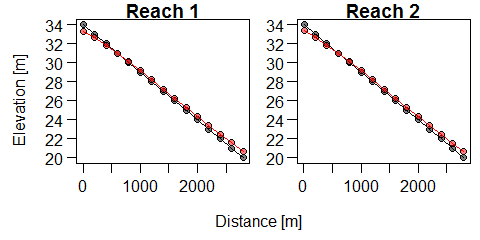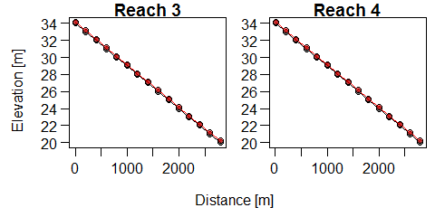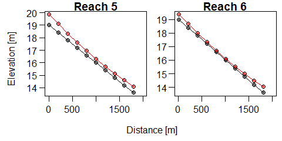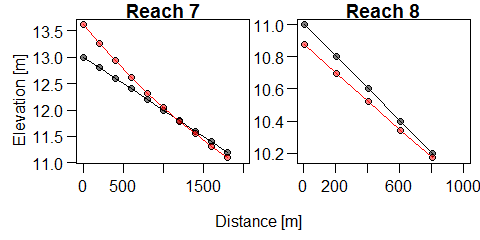
This shows initial (black) and final (red) longitudinal profiles for all modeled reaches.

A better visualization might be to see changes in bed elevation throughout the channel network.


```r
dz_plot(path = path)
```

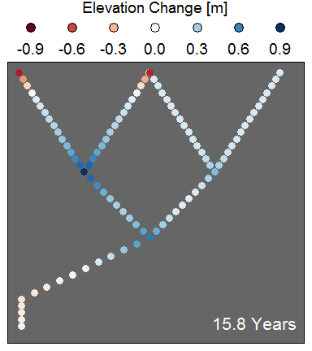

This function has some additional possible inputs. For example, `print = TRUE` would save the image in the folder specified. You can also create a gif to show changes over the course of the simulation (`gif = TRUE`). In order to made a gif, you must have [ImageMagick](https://www.imagemagick.org/script/index.php) installed. You also must supply the entire file path (i.e. no "~" at the beginning). Finally, you must have a folder "Figs" already created in the model results folder. For example, we can create a gif of changes in channel bed elevation over time:


```r
dz_plot(path = path, gif = TRUE)
```

<!-- -->

Changes in channel width can similarly be plotted at the network scale.


```r
width_plot(path = path)
```


We see incision and widening in the "urbanized" part of the watershed (top left), with deposition of mobilized sediment at tributary junctions. Althought not observed here, the channel can actually show net narrowing if the banks collapse, deposit a failed soil block at the base of the bank, and this is not eroded by the flow. It may also be interesting to see how bed $D_{50}$ varied over the course of the simulation.


```r
D50_plot(path = path)
```

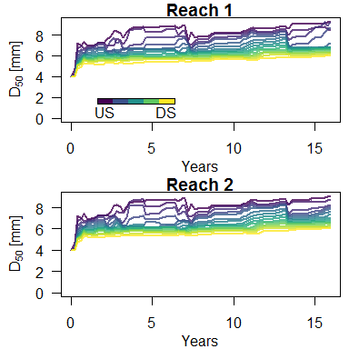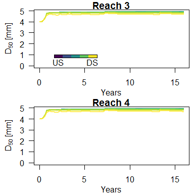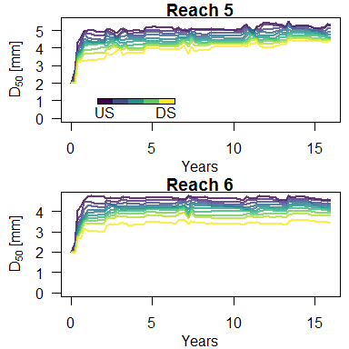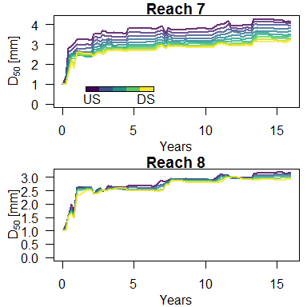

This plots changes in $D_{50}$ (mm) over time for all cross sections in each reach (purple being more upstream and yellow being more downstream). Generally, there is coarsening at all cross sections. If finer sediment is supplied from upstream or from local bank erosion, the $D_{50}$ drops. 

We can also visualize how cross sections changed over time. The `XS_plots()` function plots the initial and final geometry for the upstream most cross section in each reach.


```r
XS_plots(path)
```

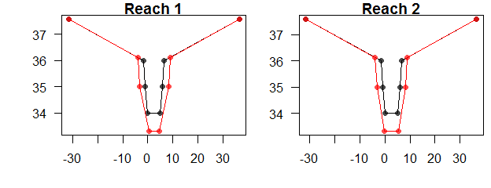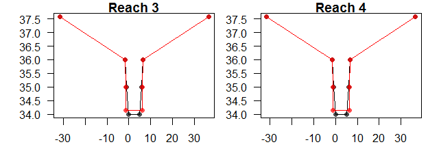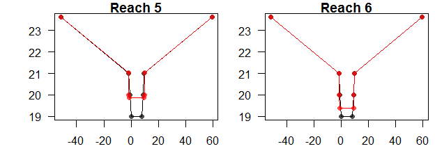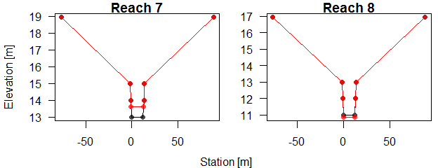

You can also plot similar geometries for *any* cross section using the `XS_plots2()` function. Just specify the XS number(s) as an input. Cross sections are numbered sequentially moving downstream by reach. In our example, the headwater reaches each have 15 XS's, so XS #16 is the first XS of reach 2. Say we want to compare the upstream and downstream most cross sections in this reach:


```r
XS_plots2(path, XS = c(16, 30))
```

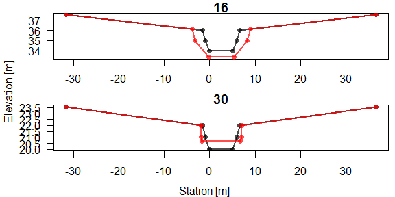

The `network_XS_plot()` shows changes over time in bed elevation, channel width, and width-depth ratio throughout the channel network.


```r
network_XS_plot(path)
```

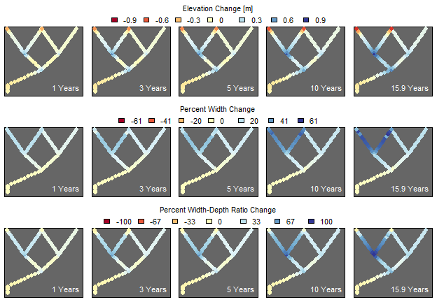

We also might be interested in comparing net sediment (bed material load only) inflow and outflow. The `sed_lines()` function compares these values over time.


```r
sed_lines(path)
```

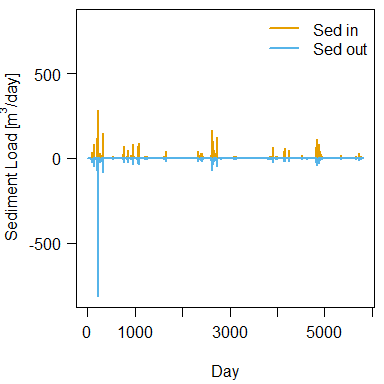

If we had included knickpoints in the model, we could visualize knickpoint migration using the `knickpoint_plot()` function.


```r
knickpoint_plot(path)
```

Total watershed fine sediment and pollutant loading is plotted using the `pollutant_loading()` function.


```r
pollutant_loading(path, type = 1)
```

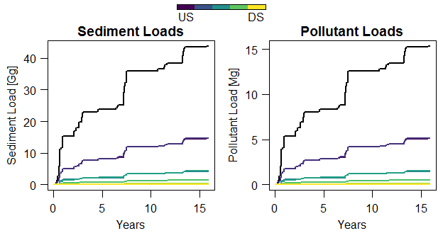

This shows watershed scale loads (black line) and loads by reach (colored lines). To show daily (rather than cumulative) loads, specify `type = 2`. In this case, sediment and pollutant loads follow the same trends. If knickpoint migration or cohesive bed erosion were modeled and these sediment had different pollutant concentrations than the banks, these plots would show more divergence.

There are also a number of "diagnostic" type functions. These are useful for visualizing different components of model performance but probably aren't of interest for presenting model results. For example, the `XS_areas()` function essentially computes a mass (volume) balance for the simulated channel network. This compares changes in channel volume to sediment inputs and outputs ($\Delta V = I - O$). It then calculates the difference in these values, which should equal zero. If this difference is greater than 1--2% of total volume change, it may indicate a modeling error or instability. The plot it produces shows channel cross section volume changes for each cross section in the network ((-) values indicate erosion and (+) indicate deposition/aggradation).


```r
XS_areas(path)
```

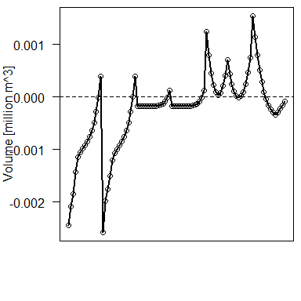

```
## Volume sum: -24111 
##  Bed vol out: 8140 
##  Bed vol in: 11131 
##  Bank tank: 0 
##  Bank washload: 27360 
##  Bed washload (cohesive): 0 
##  Knickpoint washload: 0 
##  Knickpoint correction: 0 
##  Diff: 259 
##  Percent Diff: -0.73 %
```

The basic equation to calculate `Diff` is: `Diff = Volume sum + (Bed vol out - Bed vol in) / (1 - lambda) + Bank tank + Bank washload + Bed washload + Knickpoint washload + Knickpoint correction`. Dividing the bed sediment volumes by `(1 - lambda)` converts from volume of sediment to bulk volume (dividing by 1 - porosity). The `Bank tank` is the volume of any collapsed soil blocks that couldn't "fit" at the base of the bank (this extra material doesn't affect channel geometry but no additional bank erosion is allowed until this material is eroded). `Bank washload`, `Bed washload`, and `Knickpoint washload` are volumes of washload from the bank, cohesive bed, and knickpoint, respectively. Comparing these values gives you an idea of how much pollutant loading comes from each of these sources. `Knickpoint correction` corrects for errors the cross section volume calculation when a knickpoint is initially between two cross sections. If the `Percent Diff` is greater than a couple %, it may indicate numerical errors in running the model. The most likely solution is to reduce the model time step (`dt`). Note that this mass balance equation doesn't work if meandering was simulated. The volume differences in the cross sections can't be readily calculated through time as the channels lengthen.

Other "diagnostic" functions include plotting changes in stream power or channel slope over time. For example, you might be interested in how stream power varies by reach over the simulation:


```r
plot_omega(path, type = 2)
```

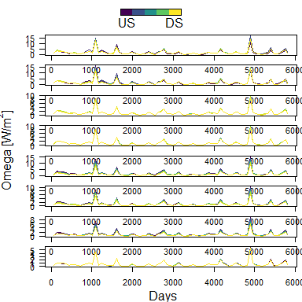
Or, you might be interested in how stream power varies spatially throughout the network over time:


```r
plot_omega(path, type = 1)
```


For our simulation which included meandering, we can plot changes in channel sinuosity and bend radius of curvature.


```r
path_meandering <- "~/WORK/Network Model v2/Documentation/Test Case/Meandering"
sinuosity_plot(path_meandering)
```

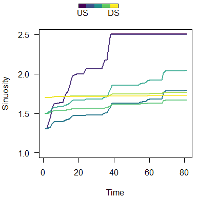

```
##         V1      V2      V3      V4      V5      V6      V7      V8
## 81 1.20214 1.20095 0.49165 0.49165 0.54574 0.16673 0.06255 0.02539
```

The `sinuosity_plot()` function also returns the change in sinuosity for each reach over the course of the simulation. This simulation showed a really significant (and possibly unrealistic) increase in channel sinuosity. Our estimate of bank $\tau_c$ may have been to low, causing excessive meander migration. Additionally, REM caps sinuosity at 2.5 to provide a control on this type of excessive meander migration.


```r
Rc_lines(path_meandering)
```

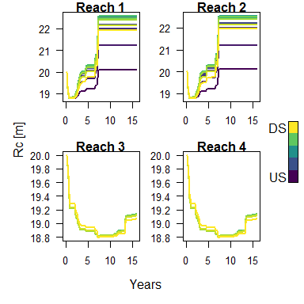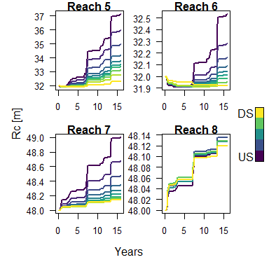

In the headwater reaches, $R_c$ actually decreases first before increasing. This is because REM assumes channel bends are circular arc segments:


If the angle of the bend is <180&deg;, meander migration causes tighter bends (i.e. reduced $R_c$). As the bend angle increases above 180&deg;, meander migration increases $R_c$.

We can also plot changes in pollutant loading to compare to our previous simulation. The meandering simulation had almost 3x the sediment and pollutant loading as the non-meandering simulation. The added erosion from channel migration can clearly supply a lot of sediment to the watershed.


```r
pollutant_loading(path_meandering)
```

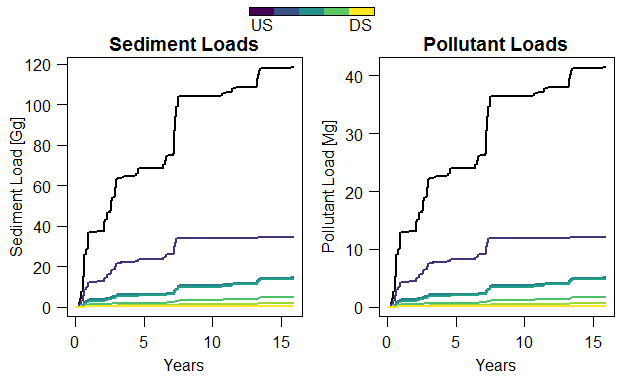

A list of post-processing functions is provided in the table below. Also see the `REMvisualizer` package [documentation](https://github.com/rodlammers/REMvisualizer/blob/master/REMvisualizer.pdf) for details on function inputs and outputs.

<table class="table table-condensed" style="width: auto !important; margin-left: auto; margin-right: auto;">
<caption>R functions for displaying REM output.</caption>
 <thead>
  <tr>
   <th style="text-align:left;"> Function.Name </th>
   <th style="text-align:left;"> Description </th>
  </tr>
 </thead>
<tbody>
  <tr>
   <td style="text-align:left;"> `avg_widths()` </td>
   <td style="text-align:left;"> Returns average widths for each reach, plots if specified </td>
  </tr>
  <tr>
   <td style="text-align:left;"> `D50_plot()` </td>
   <td style="text-align:left;"> Plots changes in bed $D_{50}$ for each XS within each reach </td>
  </tr>
  <tr>
   <td style="text-align:left;"> `dz_lines()` </td>
   <td style="text-align:left;"> Plots changes in bed elevation for the upstream XS of each reach (type = 1) or all XS in each reach (type = 2) </td>
  </tr>
  <tr>
   <td style="text-align:left;"> `dz_MC_plot()` </td>
   <td style="text-align:left;"> Creates three network plots showing uncertainty in modeled changes in bed elevation </td>
  </tr>
  <tr>
   <td style="text-align:left;"> `dz_plot()` </td>
   <td style="text-align:left;"> Network plot of changes in bed elevation. Can also create a gif of simulation over time. </td>
  </tr>
  <tr>
   <td style="text-align:left;"> `gsd_maker()` </td>
   <td style="text-align:left;"> Creates a grain size distribution given a series of grain sizes, $D_{50}$, and spread of the distribution </td>
  </tr>
  <tr>
   <td style="text-align:left;"> `knickpoint_plot()` </td>
   <td style="text-align:left;"> Shows position over time of any knickpoints in the reaches. Also prints the annual migration rate. </td>
  </tr>
  <tr>
   <td style="text-align:left;"> `network_XS_plot()` </td>
   <td style="text-align:left;"> Creates three series of plots: changes in bed elevation, change in width, and change in width-depth ratio throughout the channel network over time. </td>
  </tr>
  <tr>
   <td style="text-align:left;"> `plot_omega()` </td>
   <td style="text-align:left;"> Plots specific stream power longitudinally by reach (type = 1) or over time by reach (type = 2). </td>
  </tr>
  <tr>
   <td style="text-align:left;"> `pollutant_loading()` </td>
   <td style="text-align:left;"> Plots either cumulative or daily fine sediment and pollutant loading for the watershed </td>
  </tr>
  <tr>
   <td style="text-align:left;"> `profiles()` </td>
   <td style="text-align:left;"> Plots channel longitudinal profiles (type = 1 all reaches on same plot; type = 2 each reach has own plot) </td>
  </tr>
  <tr>
   <td style="text-align:left;"> `RC_lines()` </td>
   <td style="text-align:left;"> Plots meander bend radius of curvature over time for all XS by reach </td>
  </tr>
  <tr>
   <td style="text-align:left;"> `reach_loads()` </td>
   <td style="text-align:left;"> Network plot of sediment loading by reach. Either for single model run (n_MC = 0) or MC results (n_MC &gt; 0). </td>
  </tr>
  <tr>
   <td style="text-align:left;"> `sed_lines()` </td>
   <td style="text-align:left;"> Plots watershed sediment inflow and outflow by day. </td>
  </tr>
  <tr>
   <td style="text-align:left;"> `sinuosity_plot()` </td>
   <td style="text-align:left;"> Plots sinuosity over time by reach. Also returns values for sinuosity change over the course of the simulation. </td>
  </tr>
  <tr>
   <td style="text-align:left;"> `slope_lines()` </td>
   <td style="text-align:left;"> Plots channel bed slope over time for each cross section by reach. </td>
  </tr>
  <tr>
   <td style="text-align:left;"> `width_depth()` </td>
   <td style="text-align:left;"> Plots width-depth ratio for each cross section by reach. If "plot = FALSE", returns the computed values. </td>
  </tr>
  <tr>
   <td style="text-align:left;"> `width_lines()` </td>
   <td style="text-align:left;"> Plots changes in average channel width over time for each cross section by reach. </td>
  </tr>
  <tr>
   <td style="text-align:left;"> `width_MC_plot()` </td>
   <td style="text-align:left;"> Creates three network plots showing uncertainty in modeled changes in channel width </td>
  </tr>
  <tr>
   <td style="text-align:left;"> `width_plot()` </td>
   <td style="text-align:left;"> Network plot of changes in channel width. Can also create a gif of simulation over time. </td>
  </tr>
  <tr>
   <td style="text-align:left;"> `XS_areas()` </td>
   <td style="text-align:left;"> Diagnostic function that calculates a mass (volume) balance of changes in channel geometry and sediment input/output. Prints cumulative volume change in channel geometry for all cross sections and volume inputs and output of sediment and bank and bed washload. This difference should be zero. The calculated difference is provided as well as a percent difference. The plot shows changes in channel volume for each XS ((-) value indicates larger channel and (+) value indicates smaller channel). </td>
  </tr>
  <tr>
   <td style="text-align:left;"> `XS_plots()` </td>
   <td style="text-align:left;"> Plots initial and final XS geometry for the upstream most XS in each reach. </td>
  </tr>
  <tr>
   <td style="text-align:left;"> `XS_plots2()` </td>
   <td style="text-align:left;"> Plots initial and final XS geometry for any specified XS in the channel network. </td>
  </tr>
  <tr>
   <td style="text-align:left;"> `XS_plots3()` </td>
   <td style="text-align:left;"> Plots XS geometry over time for any specified XS in the channel network. </td>
  </tr>
</tbody>
</table>

## Monte Carlo Simulations
REM is designed to run Monte Carlo (MC) simulations. This consists of running the model hundreds or thousands of times, varying the input variables slightly across all these simulations. This provides a distribution of model outputs which accounts for uncertainty in these inputs. Most --- but not all --- inputs can be varied in MC simulations (see table of model inputs). Most notably, discharge and sediment supply can not be varied (this is mostly due to the difficulty in providing variable discharges in hundreds or thousands of input files). The input variables to be varied are specified in the "MC Inputs.txt" file. These options are:

+ "width"
+ "Ds"
+ "ps"
+ "n"
+ "fp"
+ "bank_prop"
+ "geom"
+ "hiding"
+ "meandering"

The output variables to be printed are specified in the "MC Outputs.txt" file. These options are "Ds", "width", "loading", and "z". A single output file for each MC simulation will be created. You must have a folder titled "MC Outputs" within the parent directory for these output files to be properly printed.

The number of MC simulations is specified in the "Model Inputs.txt" control file. There is also an option to specify the maximum number of threads used in these simulations. (Each CPU or "core" on your computer consists of two "threads". In your Task Manager, each thread is shown separately under "CPU Performance".) REM runs MC simulations in parallel, which can greatly reduce model run time. If "max_threads" is 0, all available threads are used. If you want to leave some threads free (to free up computing power to do other things while REM runs), you can specify a maximum number of threads to use. It may also be necessary to cap the maximum number of threads if you are lucky enough to be using a computer with lots of threads (>30). There is a limit to the number of files that REM can open/create at one time but you will only run into this issue if you have a very nice computer (if this is a problem, an error message will be printed telling you to reduce the number of threads).

Most MC input files simply repeat the same format as the corresponding normal input file, for as many MC iterations as you wish to run. An exception is the channel width file which shifts from column to row format, with one row per MC iteration (and one column per modeled reach). Another unique case is the "Input Ds MC.txt" file. Usually, this would be used if you are modeling a single grain size but want to vary this input. If you are modeling a full grain size distribution, you would probably not vary Ds but instead vary ps in the "Input ps MC.txt" file. Although not all input variables can currently be varied in MC scenarios, I am working on expanding this to include other inputs (e.g. initial bed elevation, knickpoint variables, etc.).

If you are using R to create your MC inputs, it is useful to use the `qrng_get` and `qrng_alloc` functions from the `gsl` package. These enable you to use Sobol quasi-random numbers to generate your 'random' input variables. These have several advantages over other random number generators --- namely that they provide more uniform coverage across the sample space (e.g. better distribution over the range of values) and they are static, meaning they won't change if you re-set your variables and re-run a simulation.

This pair of functions will give you a set of these quasi-random numbers given the number of simulations (`n_MC`) and the number of inputs your are varying (`n_var`).

```r
#Create all MC outputs
n_MC <- 100
n_var <- 18
rand <- qrng_get(qrng_alloc(type = "sobol", dim = n_var), n = n_MC)
```


For the test case, I varied initial grain size distributions, bank soil properties (e.g. $\tau_c$, cohesion, etc.), Mannings n values, intial bottom width, and bank geometry. Be sure to specify these variables in the "MC Inputs.txt" file: "ps", "bank_prop", "n", "width", and "geom". For this example, I had the model print bed elevations, channel width, and watershed pollutant loading for each MC simluation (specifying "loading", "z", and "width" in the "MC Outputs.txt" file). These outputs are printed in a folder called "MC Outputs" (which must be created by the user before the model is run). MC simulations are run in the same way as a normal model --- by double clicking the .exe file --- but make sure that `MC` in the "Model Inputs.txt" file is changed to the number of simulations you wish to run (100 in this case).

Not all the model post-processing functions described above work with MC simulations; however, I will describe several that do. You can examine uncertainty in modeled bed elevation using the `dz_MC_plot` function:


```r
dz_MC_plot(path = path, n_MC = 100)
```

```
## [1] "Reading data from file..."
```

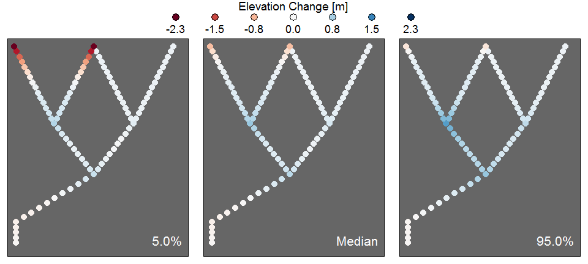

This will print three plots, showing the 5th, 50th (median), and 95th percentile of the simulations. These upper and lower percentiles can be changed. For example, to plot the 25th and 75th percentiles:


```r
dz_MC_plot(path = path, n_MC = 100, prob = c(0.25, 0.75))
```

```
## [1] "Using data already read from file."
```

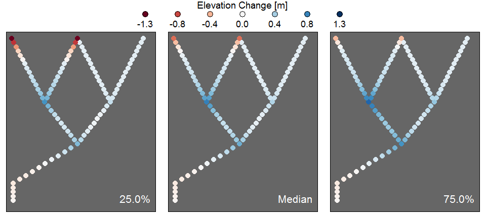

The second time we ran the `dz_MC_plot` function, it used the MC results file it had already loaded, saving a considerable amount of time (especially if you have >1000 files). To force the function to re-read the results files (say if you ran a new REM simulation), simply specify `use_files = FALSE`. 

We can also plot uncertainty in modeled changes in channel width using the `width_MC_plot` function:


```r
width_MC_plot(path = path, n_MC = 100)
```

```
## [1] "Reading data from file..."
```

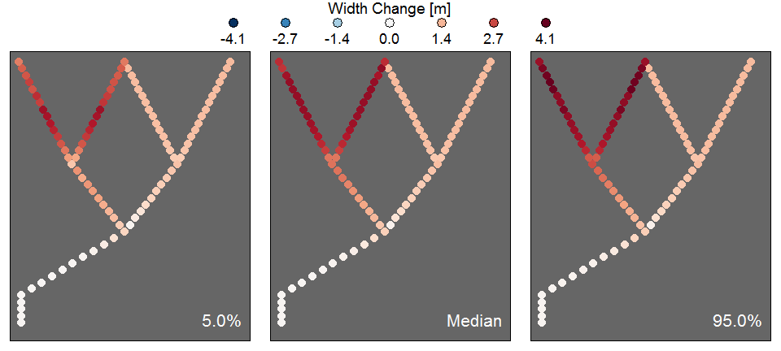

We can also see where most of the fine sediment loading is coming from using the `reach_loads` function.


```r
reach_loads(path = path, n_MC = 100)
```

```
## [1] "Reading data from file..."
```

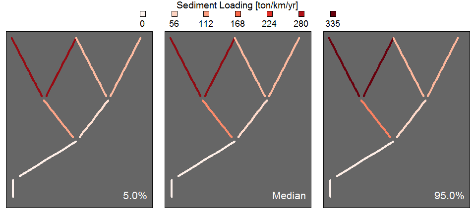

To look at pollutant loading instead of fine sediment loading, specify `type = "p"`. Since we only included bank erosion in our simulation, these results will look the same.

## Editing code and recompiling
If you have any interest in customizing or editing the REM code, feel free to download it from [GitHub](https://github.com/rodlammers/REM). The code is all in C++ and was written and compiled using Microsoft Visual Studio (a free, community version is [available](https://visualstudio.microsoft.com/)). Visual Studio has the ability to link to GitHub, so you can set up a link to the online REM repository (https://github.com/rodlammers/REM), and issue a "pull" request to import the code directly into Visual Studio.

To compile the code, you will need to follow a couple of additional steps:

  1. Download the [boost library](https://www.boost.org/)
  2. Make the following changes to the "Project Properties" in Visual Studio:
      + Add the file path to the downloaded boost library under "C/C++\\General\\Additional Include Directories" (e.g. "C:\\boost_1_63_0\\")
      + Add the boost lib file path under "Linker\\General\\Additional Library Directories" (e.g. "C:\\boost_1_63_0\\stage\\lib")
      + Enable code parallelization by changing "C/C++\\Code Generation\Runtime Library" to "Multi-threaded (/MT)" and "C/C++\\Language\\Open MP Support" to "Yes (/openmp)"
      
You should then be able to edit and compile the REM code.

If you notice any bugs or errors, feel free to create an "Issue" note on [GitHub](https://github.com/rodlammers/REM). Or email me at rodlammers@gmail.com.

##References

